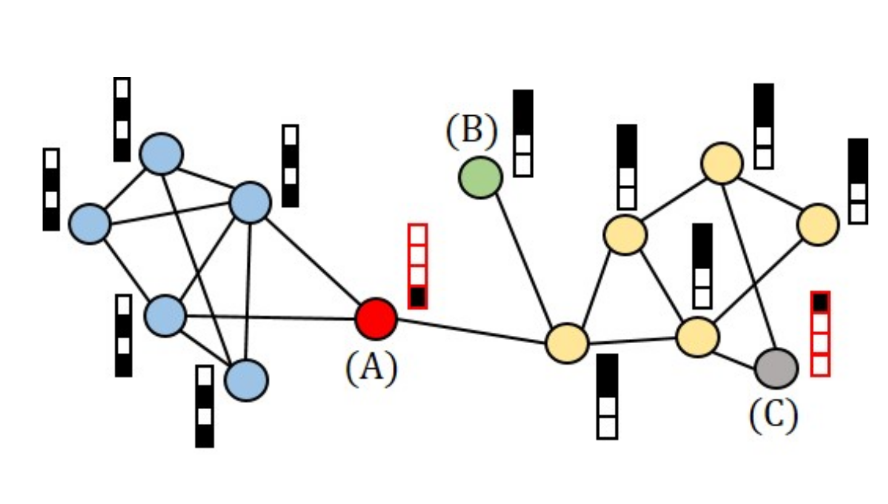



### Graph

Graphs are a kind of data structure that models a set of data objects and their relationships. The data objects are typically known as Nodes and their relationship as Edges. In a simpler way, one can visualize an edge as a connection between two nodes and that connection implies the relationship between the nodes. Graphs are utilized  as unique non-Euclidean data structures for machine learning across various domains such as the denotation of a large number of systems across various areas including social sciences, natural sciences, knowledge graphs, protein-protein interaction networks, and various other researches.

### Anomalies

The term 'Anomaly' basically signifies abnormal pattern which is significantly different from normal pattern. Different types of anomalies can exist even in graphs. Those anomalies are discussed in the following section.

### Types of Graph Anomalies

* Node Level Anomaly:

    Each of the node in the graph contains certain features which are known as node attributes. On the other hand, all  nodes follow some structural pattern in a graph. Node level anomalies can happen if anomalies present in node attributes or in structural patterns or in both.

    In the figure, nodes are represented by round-shaped objects with different colors. Node attributes are represented by vertical bars with white and black colors. According to attributes, node 'A' and node 'C' are anomalous. But according to structure, node 'A' and 'B' are anomalous as they do not belong to any communities (see the right and left cluster of nodes). Hence, node 'A' is indeed  anomalous both attribute-wise and structure-wise.

* Edge Level Anomaly:

    Edge represents the  relationship between nodes. Hence, the presence of fake edge or absence of any edge which contradicts the relationship between nodes in reality is known as edge level anomaly. Moreover, features connected with edges are known as edge attributes. If edge attributes are anomalous, then it is also termed as edge level anomaly.

* Sub-graph Level Anomaly:

    A small portion of the graph is known as sub-graph. If a sub-graph shows anomalous behavior compared to the other portions of the graph, then it is called as sub-graph anomaly.

* Graph Level Anomaly:

    Graph level anomaly indicates the presence of abnormal patterns in a graph among a set of graphs.

### Conclusion

The graph and different types of anomalies in graph are discussed here. Knowledge of these anomalies is quite important as the information is needed to detect anomalies in graphs. Graph anomaly detection has been drawing much attention over the past few years. It has important applications  in many real-world problems such as fraud detection in banking and social networks, threat detection in cyber security etc. With the advancement of Graph Neural Network and Reinforcement Learning models the interest in this field has grown exponentially. It is now a very vibrant and active field of research and lot of new techniques are sure to come in coming years to solve the problems more effectively.

## References

1. J. Zhou, _et.al._, AI Open **1** (2020) 57-81.
2. J. Hwan Kim, _et al._,  arxiv 2209.14930 (2022).
3. Picture Courtesy:  J. Hwan Kim, _et al._,  arxiv 2209.14930 (2022).
