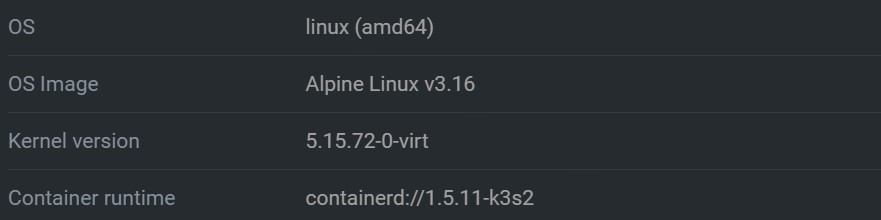



Pixie is a great platform for monitoring telemetry data from your Kubernetes cluster.
It provides both UI dashboards and a command-line interface. However, when trying to deploy Pixie on your Civo Kubernetes cluster,
you might run into an error in which your Pixie deployment cannot gather data from your cluster. This results
in an empty dashboard, and an error: `Table 'http_events' not found`. This post covers how to deploy Pixie on Civo Kubernetes
and how to fix this error.
________________

# Deploying Pixie On Civo Kubernetes

In this section, in order to replicate the error shown above, we are going to be using `helm` to install Pixie onto our cluster.
We do this by:

1. Creating a `sandbox` cluster on Civo.
   * This cluster can have node pools of any size. However, Pixie [recommends](https://docs.pixielabs.ai/installing-pixie/requirements/#memory) that each node have at least 1GB memory.
2. Create a deployment key on Pixie, under your profile's `Admin` settings.
3. Now that you have created your Civo cluster, you can [deploy Pixie using `helm`](https://docs.pixielabs.ai/installing-pixie/install-schemes/helm/#3.-deploy-pixie).
   * Run the following commands to install Pixie via `helm` into the correct `kubectl` context:

   ```shell
   # Add the Pixie operator chart.
   helm repo add pixie-operator https://pixie-operator-charts.storage.googleapis.com
   # Get latest information about Pixie chart.
   helm repo update
   # Install the Pixie chart (No OLM present on cluster).
   helm install pixie pixie-operator/pixie-operator-chart --set deployKey=<deploy-key-goes-here> --set clusterName=<cluster-name> --namespace pl --create-namespace
   ```

At this point, you will have deployed Pixie, only to see an error on the Pixie Live UI:  
`Table 'http_events' not found`

# Fixing The Failed Deployment

Here are a couple of things you can check for to make sure that Pixie can run on your Civo Kubernetes cluster:  

* Check the kernel versions your nodes are running.
  * According to the [official Pixie documentation](https://docs.pixielabs.ai/about-pixie/troubleshooting/#troubleshooting-operation-why-can't-i-see-data),
Pixie can only be deployed on nodes that run [specific kernel versions](https://docs.pixielabs.ai/installing-pixie/requirements/#operating-system-linux-distribution).
  * You can check the kernel version of your Civo cluster nodes by looking at Lens.
    * Follow the path below on Lens to see what your nodes are running:
`Homepage>Catalog>Clusters>{your_cluster_name}>Nodes`
    * From there, you can click on any node, and see which OS, OS Image, and Kernel version your node is running.
* Check the Kubernetes version installed on your Civo cluster.
  * Civo installs a lightweight Kubernetes called k3s.
  * The error we have created is present on k3s version `v1.23.6-k3s1`.
    * This actually ties into the previous kernel version error.
    * K3s version `v1.23.6-k3s1` uses Alpine Linux, which is not supported by Pixie at the moment.
    
  * We can bypass this by using the previous k3s version on our cluster, version `v1.22.11-k3s1`.
    * This older version of k3s uses Ubuntu, which is a distro [supported by Pixie](https://docs.pixielabs.ai/installing-pixie/requirements/#operating-system-linux-distribution).
    * This can be done by editing the config file used to create your cluster to reflect the older version of k3s:

    ```yaml
    kind: CivoKubernetes
    apiVersion: cluster.civo.crossplane.io/v1alpha1
    metadata: 
      name: sandbox
    spec:
      name: sandbox
      version: "1.22.11-k3s1"
    ```

    * Using this previous version of k3s, you can see on Lens that the correct OS, Ubuntu, is installed.
    

Now your Civo cluster will have the correct k3s version, as well as the correct OS version on each worker node. This should
also allow you to see your data on Pixie correctly.

# Conclusion

In this blog, we covered how to deploy Pixie on a Civo Kubernetes cluster. We also covered how to fix the `Table 'http_events' not found` error,
which causes your Pixie deployment to malfunction. The fix is as simple as downgrading the version of k3s we put on our cluster.
All in all, Pixie is a great tool for monitoring telemetry data, and we hope that support for Alpine Linux gets added soon.
