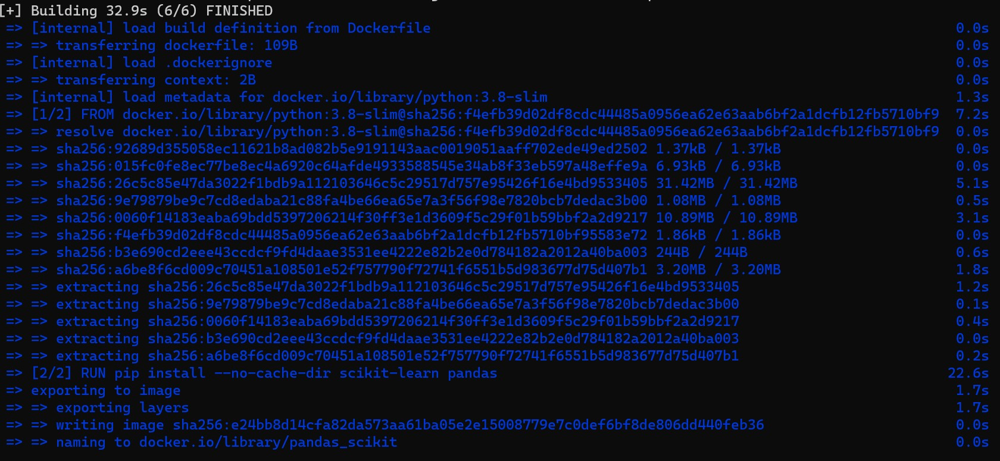
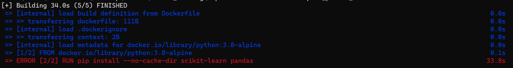
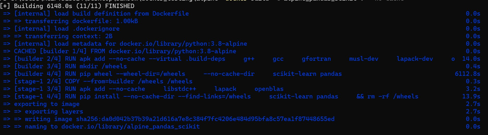

Alpine is a minimal Docker image based on Alpine linux distribution and is only 5 MB in size. The image is built around [musl libc](https://musl.libc.org/) and [BusyBox](https://www.busybox.net/) and has access to a lot of [package repositories](https://pkgs.alpinelinux.org/packages). If you are hearing about it for the first time and want to learn how to use it, check [this](https://www.docker.com/blog/how-to-use-the-alpine-docker-official-image/) out.

#### What makes alpine linux popular

Using Alpine Linux as a base image in your Docker containers has its advantages, such as a smaller footprint and a reduced attack surface. It can also help with cost saving since deployments are faster, storage requirements are lower and network transfer costs are also lower.  
BUT WAIT!!! If everything is so good why is everyone not using it already? 🤔

It is usually a great choice to use if you are building and containerizing projects written in Go, Rust, C or C++. Which is probably a choice of language used in Creating Servers or Router-based networking applications. If you are a Data Scientist or Machine Learning Engineer thinking about using Alpine Linux as a base image to containerize your ML-model, I'm afraid it may do more bad than good to you since you are mostly using python and all the jazzed up packages that comes with it. 😵‍💫🔨

#### Why should you reconsider alpine linux for base image

- Alpine linux uses musl libc instead of the more common glibc, what does that mean? Saying good bye to precompiled wheels for your popular machine learning libraries.
- You can still use them by building them from source but that means increased build times, increased memory and can even cause inconsistent behavior.

- Alpine linux packages are slower, which means they may need more compute resources compared to other distributions.
- Some security tools may not properly scan Alpine Linux for security vulnerabilities as there is no complete databases of security issues for Alpine.

- If this doesn't convice then check this out, let's pull latest Ubuntu image

 ```powershell
 $docker pull ubuntu
 Using default tag: latest 
 latest: Pulling from library/ubuntu 
 Status: Downloaded newer image for ubuntu:latest 
 ```

 now lets pull an Alpine image

 ```powershell
 $docker pull alpine
 Using default tag: latest
 latest: Pulling from library/alpine
 Status: Downloaded newer image for alpine:latest
 ```

 On checking their sizes we see alpine is clearly winning.

 ```powershell
 $docker image ls
 REPOSITORY               TAG          IMAGE ID       SIZE
 alpine                   latest       9ed4aefc74f6   7.05MB
 ubuntu                   latest       08d22c0ceb15   77.8MB
 ```

 Now lets create a dockerfile to package a Python application that uses popular ML libraries [pandas](https://pypi.org/project/pandas/) and [scikit-learn](https://pypi.org/project/scikit-learn/).  
 First we will use Debian-based official Python image.

 ```dockerfile
 FROM python:3.8-slim
 RUN pip install --no-cache-dir scikit-learn pandas
 ```

 Oh No!! That build was so slow. It took me 32.9s to build that image and the size is a massive 420MB.🫤
 

 Good for me I have alpine linux to the rescue, it's only 7.05MB it should finish the build in less than 5s.😎

 ```dockerfile
 FROM python:3.8-alpine
 RUN pip install --no-cache-dir scikit-learn pandas
 ```

 What!!!😵 Build failed.
 

 Okay, not a problem it looks like the build failed because we dont have a precompiled wheel. Hate to do it but I told you so.😏 Let's install the dependencies first and then build the scikit-learn from source, that should be easy. Right?

 ```dockerfile
 # Stage 1: Install build dependencies and build wheels
 FROM python:3.8-alpine as builder
 # Update package list and install build dependencies
 RUN apk add --no-cache --virtual .build-deps g++ gcc gfortran musl-dev lapack-dev openblas-dev
 # Create a directory to store wheels
 RUN mkdir /wheels
 # Build wheels for scikit-learn and pandas
 RUN pip wheel --wheel-dir=/wheels --no-cache-dir scikit-learn pandas
 # Stage 2: Install the wheels, remove build dependencies
 FROM python:3.8-alpine
 # Copy wheels from the builder stage
 COPY --from=builder /wheels /wheels
 # Install runtime dependencies
 RUN apk add --no-cache libstdc++ lapack openblas
 # Install scikit-learn and pandas from wheels
 RUN pip install --no-cache-dir --find-links=/wheels scikit-learn pandas && rm -rf /wheels
 ```

 😮‍💨 After a 102min long build I finally have my project image built using alpine linux.
 

 Let's see if I atleast get my tiny image as expected because I'm using Alpine linux as the base image to build.

 ```powershell
 $docker image ls
 REPOSITORY               TAG          IMAGE ID       CREATED         SIZE
 alpine_pandas_scikit     latest       da0d042b37b3   9 minutes ago   604MB
 pandas_scikit            latest       e24bb8d14cfa   3 hours ago     420MB
 ```

 Well...!!!😮‍💨 We all knew where it was heading. I'm not surprised. Are you?

#### Conclusion

 While Alpine Linux has its benefits, it may not be the best choice for every project, particularly those involving Python and it's Jazzed up libraries for Machine Learning. It is essential to evaluate specific requirements of your project and chose the most suitable base image accordingly.
