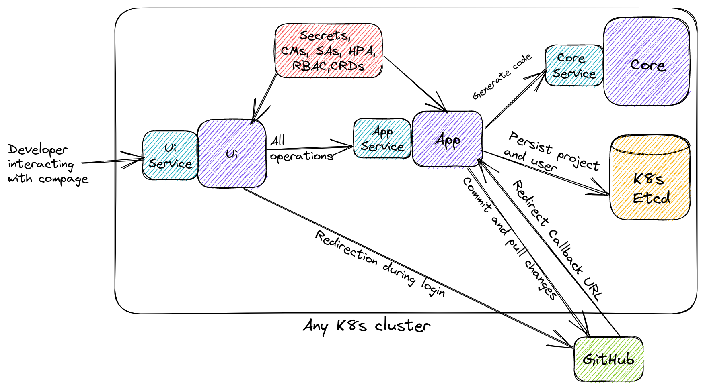
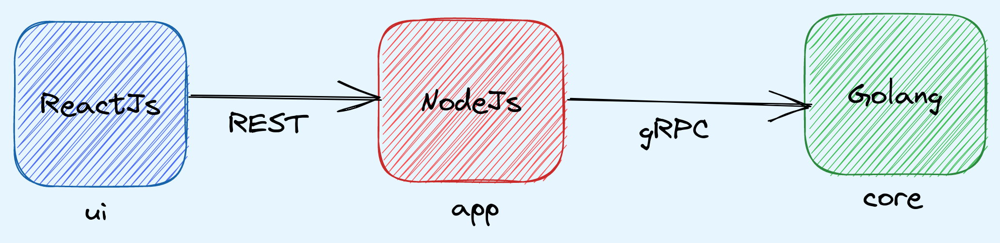



We recently launched a new open source project for cloud native ecosystem & first of its kind! Give us a ⭐ if you like the efforts we are putting!

Faster software delivery and security are often seen as opposing forces in software development, but they should complement each other.

New technologies pose challenges for developers, while companies struggle to retain top talent. The endless onboarding process affects code quality, which, in turn, impacts the entire software supply chain.

To address these challenges, IntelOps has launched [𝐂𝐎𝐌𝐏𝐀𝐆𝐄](https://github.com/intelops/compage), a framework that follows a diagram-to-code approach to develop Rest APIs, gRPC, dRPC, GraphQL APIs, WebSockets, Micro-services, FaaS, Temporal workloads, IoT and edge services, K8s controllers, K8s CRDs, K8s custom APIs, K8s Operators, K8s hooks, and more.

✅ The code base is generated in secure programming languages like Go and Rust, which can be deployed to any cloud native tech stack.

✅ Compage automatically applies and also enforces to follow best practice methods such as software supply chain security measures like SBOM, GITBOM, digital signature & attestation, ledger, code quality, openAPI, cloud-events specs, vulnerability scans, dependency tracking, verifications, auto instrumentation for monitoring & observability, and many more, ensuring that the code adheres to industry standards and practices.

We are working very hard to add features continuously. 🙌

Compage helps developers to customize the code as per their requirements while learning about the standards as it guides them through following the best practices step by step.

We invite you to learn more about Compage's capabilities and encourage you to try this solution and share your feedback with us.

Let's see a few details about Compage.

Compage has 3 main components.

### core

This is a Go component and a gRPC server. You can contribute to this by adding more generators. When you want to support new protocol or a language or a framework, you will have to majorly add code to this component.

### app

This is a NodeJS component and a gRPC client to the core component. This is also a REST server (express js) to ui component. When you want any new api endpoint for the ui component, you will have to add that here.
Currently, compage supports login with GitHub. When BitBucket or GitLab integration will be added, major code changes will go here.

### ui

This is a ReactJS component and a REST client to app component. This has an integration with aws diagram-maker for canvas. Any changes related to UI will go in this part of compage.

To know how to contribute to Compage, you can check the [Contributing](https://github.com/intelops/compage/blob/main/CONTRIBUTING.md) section.
