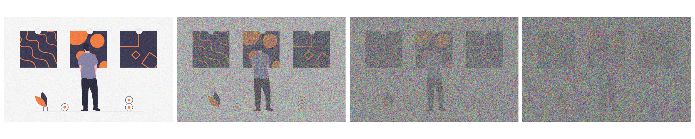
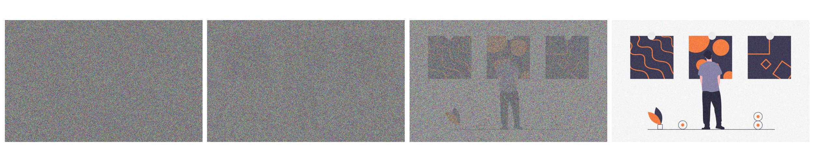
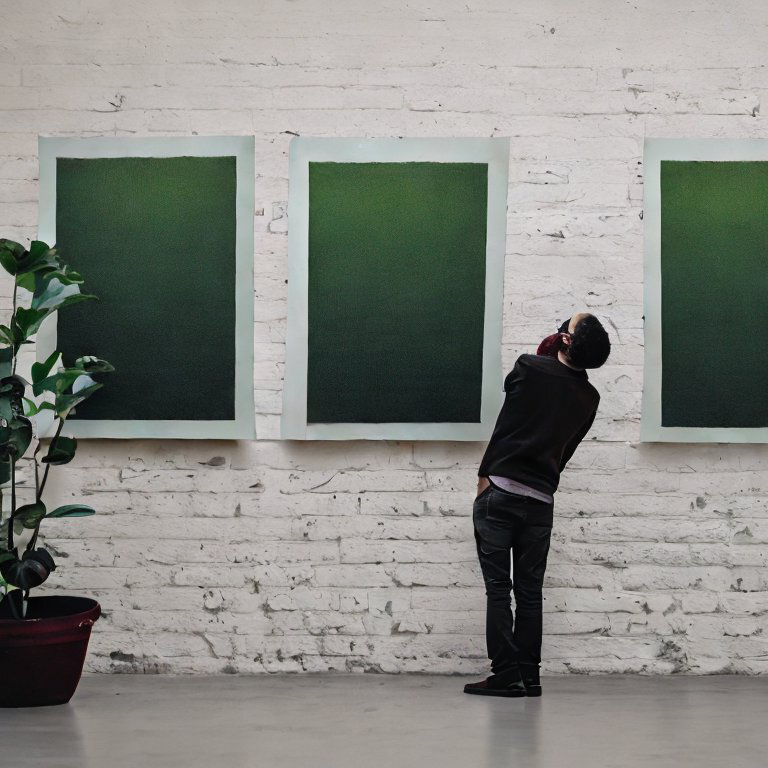



Just within the past year, we have seen an explosion in the release of new machine learning models that utilize novel
techniques and methods to achieve specific and/or general tasks. Models such as OpenAI's ChatGPT have taken
front-and-center stage, pushing other models to the back. Within these other, still reputable models, exists stable
diffusion. Let's take a shallow dive into what this model is, how it works, and why it's so contested.

________________

# What Is Stable Diffusion?

Initially [released on August 22, 2022](https://stability.ai/blog/stable-diffusion-public-release), stable diffusion is
a deep learning product of [Stability AI](https://stability.ai/) used to generate images from text input. A user
simply has to give a prompt about the image to generate, and the diffusion model will generate the image over a series
of steps. Each step will create a better version of the previous image. Sometimes, objects within the image might
change, however, the images themselves will improve in quality. These 'improvements in quality' can be attributed to
less noise in the images.

# How It Works

Stable diffusion works on the principle of `diffusion`.

> `Diffusion`: Literally means to 'spread something widely'.

However, in our case, it means to subtly add noise to an image over a series of steps. For example, consider how
gaussian noise is added to the image below:

The diffusion (noise) was slowly added over 100 steps. As you can tell, we have added enough noise to make the photo
become a full noise photo. What if we created a model to reverse the process? This model would take a noisy image as an
input, and then generate a clear image as an output. This is pretty much exactly the reverse process:

This is exactly what stable diffusion accomplishes. If we train the model good enough, we do not have to have the noise
that was generated from the original image. We can just use random noise as the input, and create an image from it!  
Let's look at it intuitively. Assuming the models goal is to work backwards, at each iteration, the model will take away
all the noise in the input image, keep one step's worth of noise, and return all the other noise back to the image. Now,
if you think about it, the image has arrived at the previous step in the process of diffusion, getting more and more
clear with each iteration.

# Benefits Of Stable Diffusion

Stable diffusion made waves when it came out, because of its sheer capability, and all of the benefits associated with
it:

* Open Source - the source code for this model is [available online](https://github.com/CompVis/stable-diffusion). This
  also means that the model is modifiable based on an individual's use cases.
* No fees - there is no cost/licensing fees associated with using this model.
* Low compute resources - there are surprisingly low compute resources for running this model, given the task that it
  accomplishes.

# Opposition - Why Do People Hate This Technology?

As there always is with a new technology, there exists opposition to the stable diffusion model. The outcry in the cases
listed below might be a bit more justified, however. Since this model is used to generate pictures, obviously there will
be some instances where people will use the 'art' generated by the model to gain money/fame:

* [An AI-generated image won first-place in the digital category at the Colorado State Fair](https://www.nytimes.com/2022/09/02/technology/ai-artificial-intelligence-artists.html) -
  While this image does look like it's first-prize worthy, it was entirely generated by a single prompt, taking no more
  than a few minutes to be generated (on a slow computer).
* [A photograph created by AI won first-prize at the Sony World Photography Awards](https://www.bbc.com/news/entertainment-arts-65296763) -
  This winner decided to take the high-road by refusing the prize after no one figured out that the photograph was
  indeed generated by AI.

Both instances have got artists fuming, as most people (especially the judges) could not tell if an image was generated
or not. Of course, they have a right to be concerned about AI intervening in the art department. Just take a look at the
stable diffusion generated image below:

