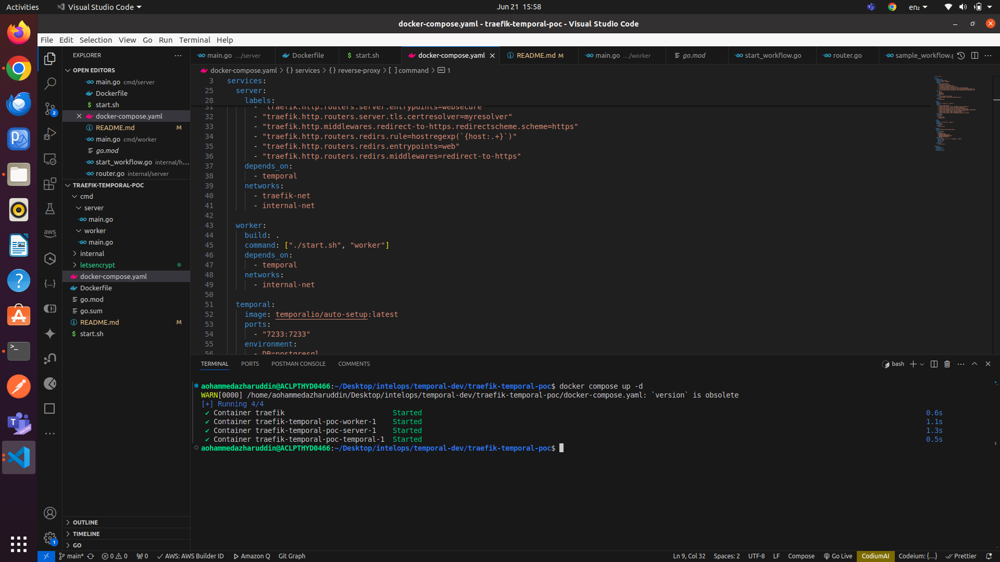
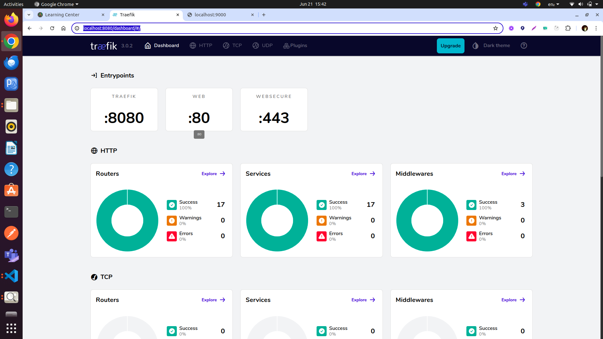
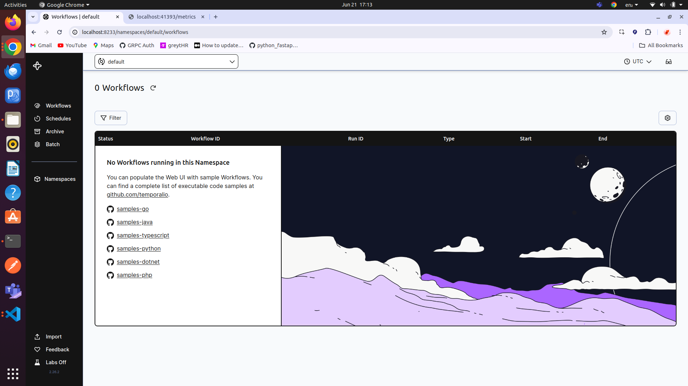
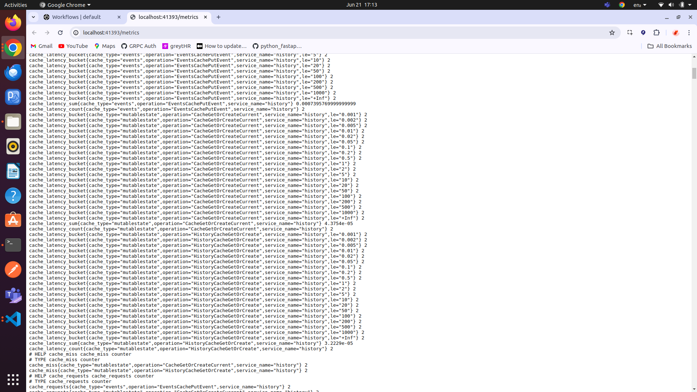
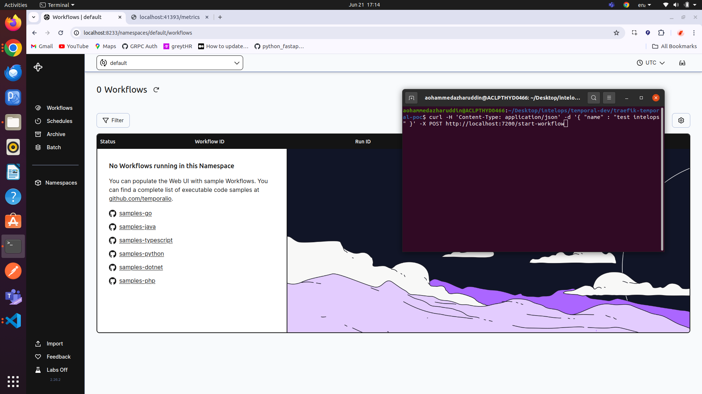
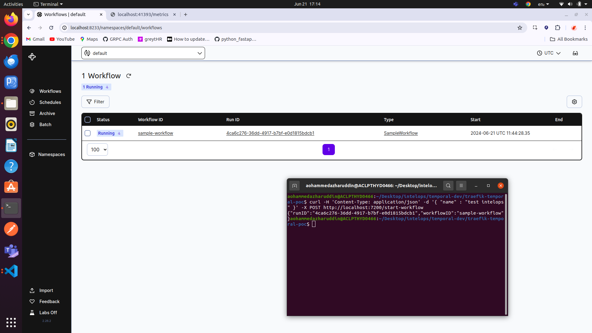
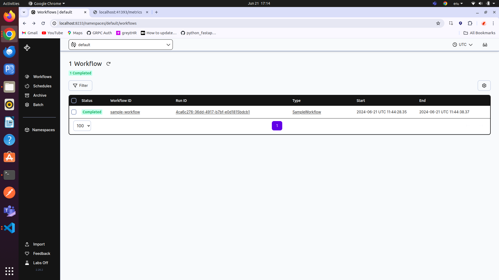
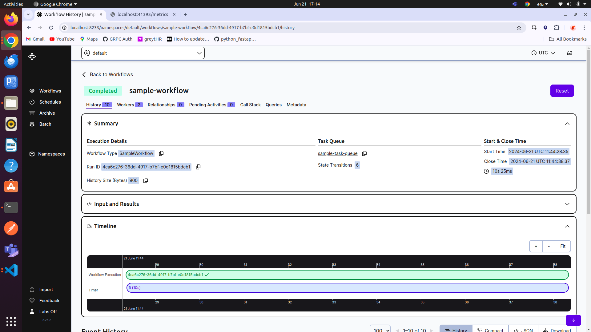

# How to Test the gin server and traefik in local environment

- You can test the gin server which contains temporal worker and traefik in local environment using the following command:

  ```docker
  # Go to root directory
  docker compose up -d
  ```

  ```bash
  # once the containers are up and running you will see the following output
    ✔ Container traefik-temporal-poc-traefik-1                             Running 0.0s
    ✔ Container traefik-temporal-poc-temporal-1                            Started 0.4s
    ✔ Container traefik-temporal-poc-worker-1                              Started 0.5s
    ✔ Container traefik-temporal-poc-server-1                              Started 0.7s
  ```

   <br/>

- To check the status of your traefik, you can click on the traefik link in the browser. [https://localhost:8080](https://localhost:8080)
  
  <br/>
- Check the temporal dashboard in the browser. [http://localhost:8233/namespaces/default/workflows](http://localhost:8233/namespaces/default/workflows)
  
  <br/>
- Check the temporal metrics on [http://localhost:41393/metrics](http://localhost:41393/metrics)
  
  <br/>
- Make a post request to run workflows in temporal.
  ```bash
  curl -H 'Content-Type: application/json' -d '{ "name" : "test intelops" }' -X POST http://localhost:7200/start-workflow
  ```
  
  <br/>
- The post request will create a new workflow in temporal. You can see the dashboard with the new workflow in the temporal dashboard. [http://localhost:8233/namespaces/default/workflows](http://localhost:8233/namespaces/default/workflows)
  
  <br/>

- This workflow will be executed till the worker completes its activity or task. Once it's done, the workflow will be marked as completed.
  
  <br/>

- We can also see the overview/history of the workflow in the temporal dashboard. [http://localhost:8233/namespaces/default/workflows](http://localhost:8233/namespaces/default/workflows)
  
