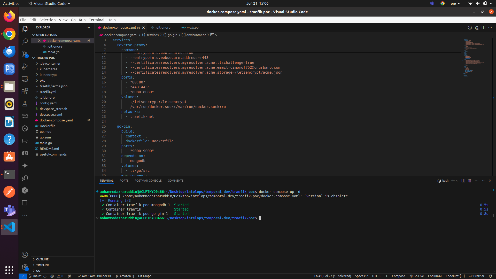
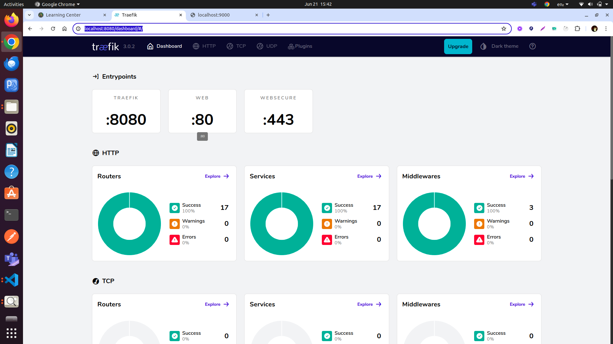
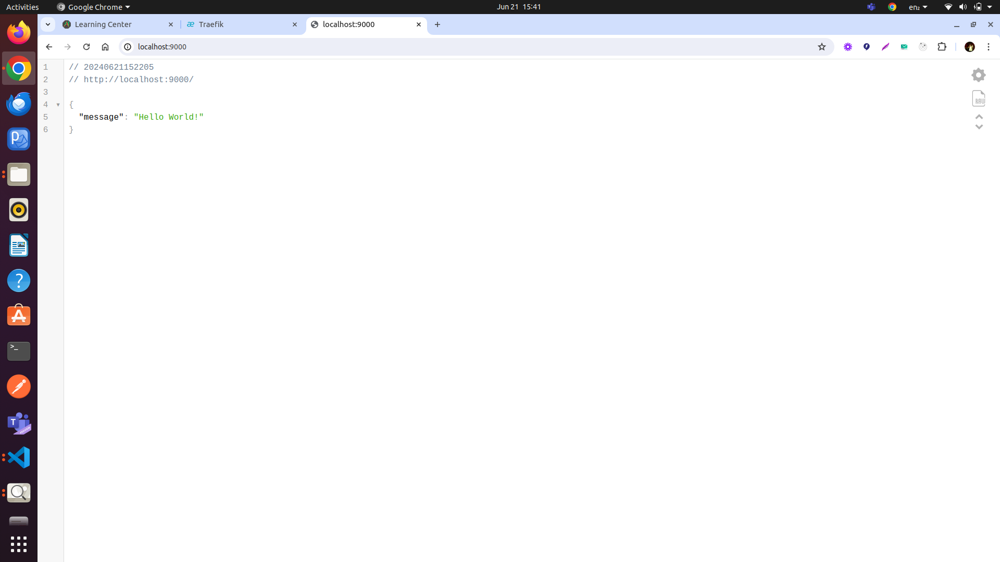

# How to Test the gin server and traefik in local environment

- You can test the gin server and traefik in local environment using the following command:
    ```docker
    # Go to root directory
    docker compose up -d
    ```
    ```bash
    # once the containers are up and running you will see the following output
    ✔ Container traefik-poc-mongodb-1                        Started 0.6s 
    ✔ Container traefik                                      Started 0.5s 
    ✔ Container traefik-poc-go-gin-1                         Started 0.5s
    ```


- To check the status of your traefik, you can click on the traefik link in the browser. [https://localhost:8080](https://localhost:8080)


- To check the status of your gin server, you can click on the gin server link in the browser. [https://localhost:9000](https://localhost:9000)
