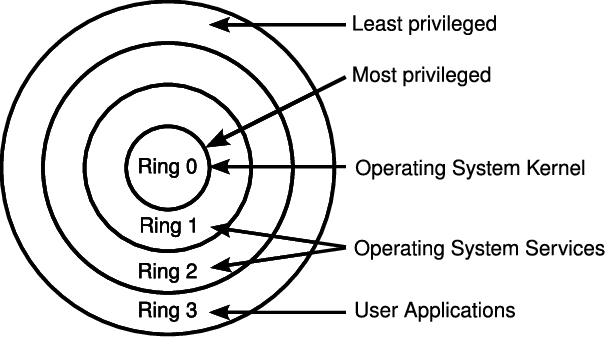
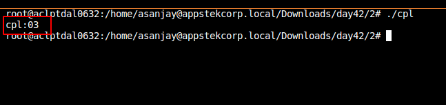
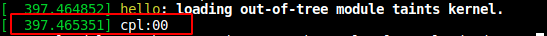

### Introduction
System calls in Linux are crucial bridges that allow user-space processes to request services from the kernel, thus functioning as an intermediary between user commands and hardware actions. These calls facilitate interactions with the kernel, allowing it to perform various operations such as managing storage, memory, network, and processes on behalf of the user. This blog explores the intricacies of system calls, their significance in operating systems, and their implementation and execution within a Linux environment.

### What is a System Call?
A system call is essentially a request made by a user-space process to the kernel to execute specific services or tasks. It serves as a mechanism through which applications can communicate with and utilize the services managed by the operating system, like storage, memory, and network management, without directly interacting with the hardware.

### Services Provided by Kernel:
The kernel provides an array of services which include but are not limited to:
1. **Writing/Reading files:** Managing input/output operations on files.
2. **Managing Socket Connections:** Listening for connections on a socket.
3. **Directory Management:** Creating and deleting directories.
4. **Process Management:** Creating and executing new processes.

In Unix systems, the C library offers wrappers around system calls, allowing high-level interaction with the kernel.

### Mechanism of a System Call:
When a system call is invoked, a specific kernel code snippet is executed on behalf of the requesting user process. This code runs in `ring 0` (CPL 0), which holds the highest level of privilege in x86 architecture, while all user processes operate in `ring 3` (CPL 3). 

To implement a system call mechanism efficiently, two key elements are required:
1. A method to invoke `ring 0` code from `ring 3`.
2. Appropriate kernel code to service the request.

-----





----


### Importance of System Calls:
Applications cannot directly access hardware due to security and abstraction levels provided by system calls. Having system calls offer several advantages:
1. **Ease of Programming:** Developers are freed from delving into the low-level programming characteristics of hardware devices, enabling a focus on high-level application logic.
2. **Enhanced Security:** The kernel can scrutinize the validity of requests at the interface level before attempting to fulfill them, thus fortifying system security.

### Understanding Current Privilege Level (CPL):
CPL represents the privilege level of the currently executing code and is determined by the last two bits of the Code Segment (CS) register. Various operations such as inter-segment calls, jumps, external interrupts, exceptions, and task switching can modify the CS register contents, thus altering the privilege of the currently executing code.

#### User-Space CPL Example:
```c
#include <stdio.h>
int main()
{
    int cpl;
    asm volatile("mov %%cs, %%eax"
                    :"=a"(cpl));
    cpl &= 0x03;
    printf("cpl:%02x\n", cpl);
    return 0;
}
```
**Output:** 



This user-space code snippet is executed with a CPL of `03`, indicating it runs in `ring 3`.

#### Kernel-Space CPL Example:
```c
#include <linux/kernel.h>
#include <linux/module.h>
MODULE_LICENSE("GPL");
int init_module()
{
    int cpl;
    asm volatile("mov %%cs, %%eax"
            :"=a"(cpl));
    cpl &= 0x03;
    pr_info("cpl:%02x\n", cpl);
    return 0;
}
void cleanup_module()
{
}
```
**Output:** 



This kernel-space code snippet operates with a CPL of `00`, showing it runs in `ring 0`.

### Conclusion:
System calls are pivotal in Linux, acting as conduits between user processes and kernel services. They offer an abstraction layer that not only simplifies programming by providing high-level interaction with hardware but also enhances system security by validating requests at the interface level. Understanding the intricacies of system calls and the associated privilege levels is integral for both system-level programming and in-depth knowledge of Linux operating systems.
