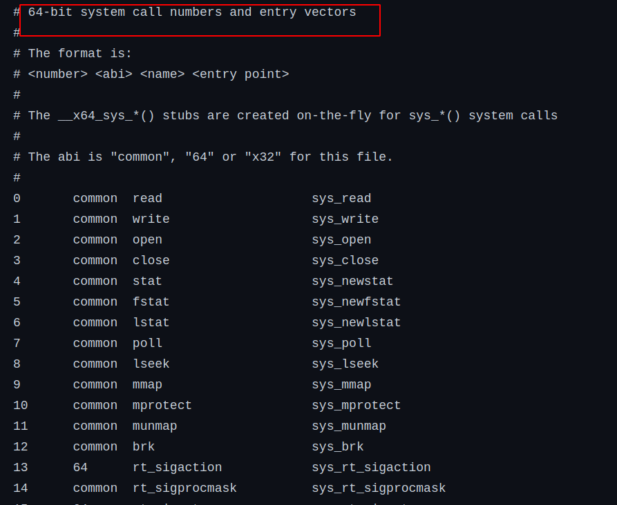

### Introduction:
In the world of Linux, understanding the intricacies of how user-space applications interact with the kernel is fundamental to gaining insight into the operating system's workings. One critical component facilitating this interaction is the system call number, a unique identifier crucial for the execution of system calls. This blog explores the concept of system call numbers, their variability across architectures, and delves into the system call table, an essential element used by the kernel to map system call numbers to their respective handlers.

### Decoding System Call Numbers:
Each system call within Linux is associated with a unique system call number. This identifier is recognized by both user-space applications and the kernel. For instance, the `read()` system call is identified by number `3`, while the `open()` system call is assigned number `5`. It is vital to note that these numbers can vary depending on the architecture, exemplified by the `exit()` system call, which is assigned number `60` on `x86_64` and `1` on `x86`.

### The Role of the System Call Table:
The kernel employs a structured table, known as the System Call Table, to map each system call number to its corresponding system call handler. This table is a pivotal component of the kernel, enabling the seamless execution of system calls by providing a structured lookup to identify and execute the appropriate system call handlers based on the requested system call numbers.

### Locating the System Call Table:
The location of the System Call Table is architecture-specific within the Linux source code:
- **For x86 architecture:** [arch/x86/entry/syscalls/syscall_32.tbl](https://github.com/torvalds/linux/blob/master/arch/x86/entry/syscalls/syscall_32.tbl)
- **For x86_64 architecture:** [arch/x86/entry/syscalls/syscall_64.tbl](https://github.com/torvalds/linux/blob/master/arch/x86/entry/syscalls/syscall_64.tbl)
- **For ARM architecture:** [arch/arm/tools/syscall.tbl](https://github.com/torvalds/linux/blob/master/arch/arm/tools/syscall.tbl)

These locations hold the structured mappings that the kernel utilizes to determine the appropriate handlers for incoming system calls from user-space applications.

### Importance of Architecture-Specific Mapping:
Given that system call numbers are different for different architectures, the architecture-specific location of the System Call Table is crucial for maintaining the integrity and accuracy of system call executions. This specificity ensures that the kernel refers to the correct table corresponding to the architecture in use, thus avoiding discrepancies and errors in system call handling.

### Conclusion:
Understanding the nuances of system call numbers and the System Call Table is fundamental for anyone looking to gain deeper insight into the interaction between user-space applications and the kernel in Linux. The specificity of system call numbers and their architecture-dependent variations underline the meticulous organization and structuring within the Linux operating system. By exploring the architectural variations and the structured mapping of the System Call Table, we unravel a layer of Linux’s core functioning, bringing us a step closer to mastering the intricacies of this versatile operating system.

