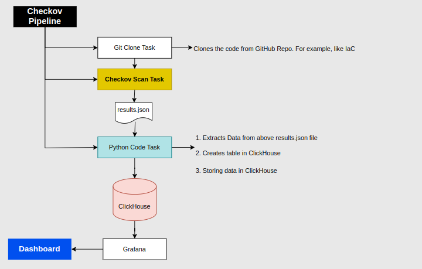

# Checkov Scanning Tool

Checkov is an open-source static analysis tool designed to identify security and compliance issues in infrastructure as code (IaC). It supports multiple cloud providers and configuration languages, making it a powerful tool for DevOps and security teams to ensure the security of their cloud infrastructure.

## About the Pipeline



## Table of Contents

- [Checkov Scanning Tool](#checkov-scanning-tool)
  - [About the Pipeline](#about-the-pipeline)
  - [Table of Contents](#table-of-contents)
  - [Introduction](#introduction)
  - [Features](#features)
  - [Getting Started](#getting-started)
    - [Installation](#installation)
      - [Usage](#usage)
- [Checkov JSON Data Extraction and Storage](#checkov-json-data-extraction-and-storage)
  - [Introduction](#introduction-1)
  - [Getting Started](#getting-started-1)
    - [Requirements](#requirements)
    - [Process Overview](#process-overview)
  - [Extraction and Storage Process](#extraction-and-storage-process)
    - [Extracting Data](#extracting-data)
    - [Storing Data in ClickHouse](#storing-data-in-clickhouse)
    - [Checkov Grafana Output](#checkov-grafana-output)
- [Conclusion](#conclusion)

## Introduction

Checkov provides a comprehensive way to identify misconfigurations, insecure defaults, and other potential issues within your infrastructure code. It can be integrated into your CI/CD pipeline to ensure that your cloud deployments meet security and compliance standards before they are deployed.

## Features

- Multi-cloud support: Checkov supports popular cloud providers such as AWS, Azure, GCP, and more.
- Configuration language support: It works with various infrastructure configuration languages, including Terraform, CloudFormation, Kubernetes YAML, and more.
- Extensible: You can write custom policies to suit your organization's specific security and compliance requirements.
- CI/CD integration: Easily integrate Checkov into your CI/CD pipeline to automate security checks.
- Easily actionable: Checkov provides clear guidance on the issues it identifies and suggests possible remediations.

## Getting Started

### Installation

To install Checkov, you can use pip:

```bash
pip install checkov
        or 
pip3 install checkov
```

Or, if you prefer using Docker:

```bash
docker pull bridgecrew/checkov
```

#### Usage

Using Checkov is straightforward. Simply navigate to your infrastructure code directory and run the following command:

```bash
checkov -d .
```

Replace the . with the path to your infrastructure code directory. Checkov will analyze your code and provide a report of any security issues it finds.

For more advanced usage and options, refer to the official Checkov Documentation.

Supported Cloud Providers
Checkov supports a wide range of cloud providers, including but not limited to:

* Amazon Web Services (AWS)
* Microsoft Azure
* Google Cloud Platform (GCP)
* Kubernetes
  
For the complete list, refer to the Supported Cloud Providers in the documentation.


# Checkov JSON Data Extraction and Storage

This guide outlines the process of extracting JSON data from the Checkov scanning tool's output and storing it in a ClickHouse database. The Python script provided demonstrates how to extract relevant information from the JSON data, structure it, and insert it into the database.

## Introduction

The Checkov scanning tool is used to identify security and compliance issues in Infrastructure as Code (IaC). This guide demonstrates how to extract relevant data from Checkov's JSON output and store it in a ClickHouse database for further analysis and reporting.

## Getting Started

### Requirements

- Checkov JSON output file
- Python
- ClickHouse database
- ClickHouse Python driver (`clickhouse-connect`)

### Process Overview

1. Extract JSON data from the Checkov output.
2. Process the JSON data to extract relevant information.
3. Store the extracted information in a ClickHouse database.

## Extraction and Storage Process

### Extracting Data

The Python script reads the Checkov JSON data, extracts information about passed and failed checks, and structures the data for insertion.

### Storing Data in ClickHouse

The processed data is inserted into a ClickHouse table with the following fields:

- `id`: UUID generated for each row
- `timestamp`: Date and time of insertion
- `check_id`: Check ID from Checkov
- `bc_check_id`: Bridgecrew check ID
- `check_name`: Name of the check
- `status`: Result of the check (passed/failed)
- `evaluated_keys`: Evaluated keys from the check

The script uses the ClickHouse Python driver to establish a connection to the database and insert the processed data.

For detailed step-by-step instructions and the Python script, refer to the provided code.

### Checkov Grafana Output


# Conclusion
Checkov is an indispensable tool for enhancing security and compliance in infrastructure as code. With multi-cloud support, compatibility with various configuration languages, and seamless CI/CD integration, it's a valuable asset for DevOps and security teams.

The Checkov JSON Data Extraction and Storage guide offers a way to extract and store critical information from Checkov's output in ClickHouse. This enables better analysis and reporting of security and compliance data.

By leveraging Checkov and data extraction, organizations can bolster their infrastructure security, ensuring deployments meet stringent standards and are protected from vulnerabilities.