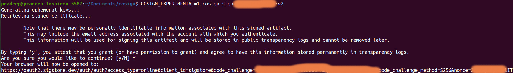
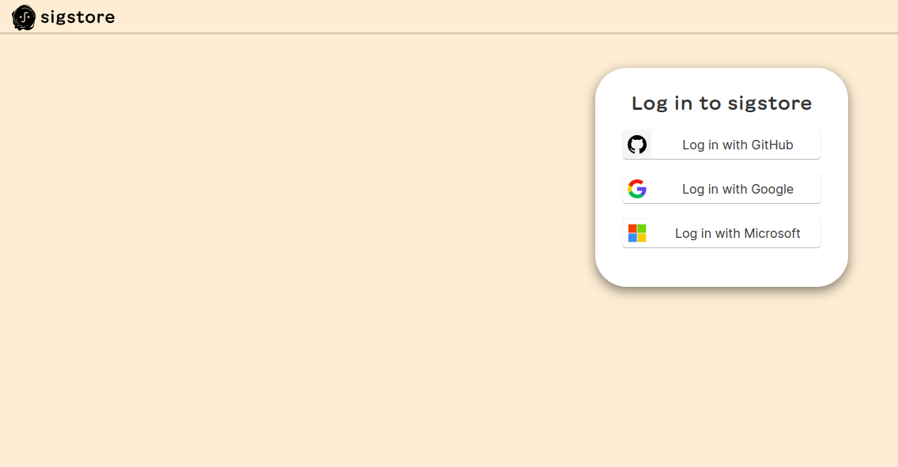
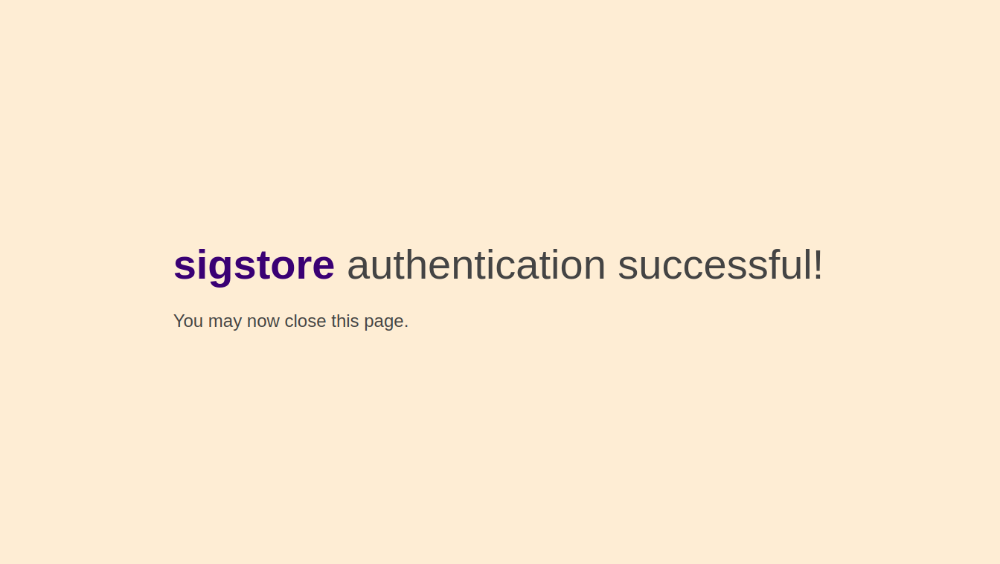
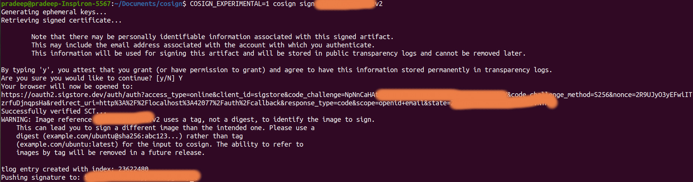
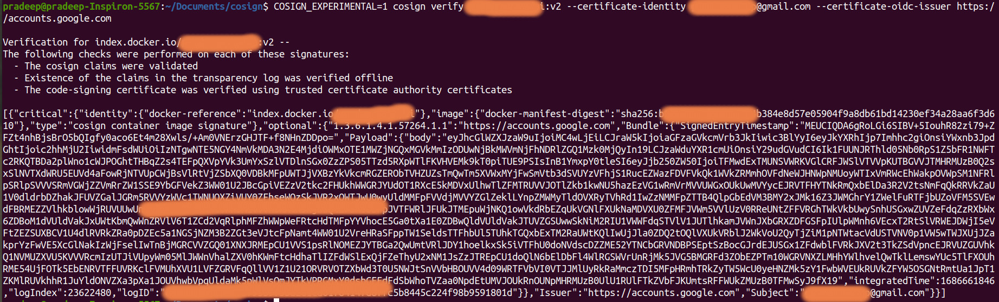

### Getting started with CoSign

#### Why Image signing:

* Authenticity: Verify that software artifacts haven't been tampered with.
* Trust and Verification: Establish trust by validating the identity of the signer.
* Mitigating Supply Chain Attacks: Reduce the risk of compromised or malicious software.
* Compliance and Auditing: Meet regulatory requirements and maintain accountability.
* Non-Repudiation: Signer cannot deny association with the signed image.

Image signing enhances security, trustworthiness, and traceability in the software supply chain.

#### Installing Cosign:

1. Homebrew (macOS):
```shell
brew install cosign
```

2. Ubuntu and Debian:

Download the latest .deb package from the releases page and run:
```shell
sudo dpkg -i ~/Downloads/cosign_1.8.0_amd64.deb
```
3. CentOS and Fedora:

Download the latest .rpm package from the releases page and install with:
```shell
rpm -ivh cosign-1.8.0.x86_64.rpm
```
4. Installing Cosign via Binary:

Download the desired binary from the releases page and run:


```shell
wget "https://github.com/sigstore/cosign/releases/download/v2.0.0/cosign-linux-amd64"
sudo mv cosign-linux-amd64 /usr/local/bin/cosign
sudo chmod +x /usr/local/bin/cosign
```

#### Singing an Image using Cosign

1. Execute the `cosign sign` command to digitally sign your image.
```shell
COSIGN_EXPERIMENTAL=1 cosign sign <IMAGE:TAG>
```

> 	Note that there may be personally identifiable information associated with this signed artifact.
	This may include the email address associated with the account with which you authenticate.
	This information will be used for signing this artifact and will be stored in public transparency logs and cannot be removed later.



Upon obtaining the OIDC Identity Token, proceed to sign the desired image using the cosign sign command. This command, accompanied by the OIDC Identity Token, initiates the signing process. If you are operating in a non-interactive mode, Cosign will automatically generate a link that needs to be opened in a web browser to complete the signing flow.

2. You have the flexibility to select your preferred OAuth provider for signing your image.



After completing the signing process, you will receive a success message on the browser screen.
   


You can verify the results of the signing process by checking the command prompt or terminal for any output or error messages after executing the signing command.



#### Verify the signed image

Please follow these formal steps:

Use the `cosign verify` command along with the signed image to initiate the verification process.

Please execute the following command to verify the image signature, ensuring that you provide the identity user and issuer information:

```shell
COSIGN_EXPERIMENTAL=1 cosign verify < IMAGE:TAG > --certificate-identity < IDENTITY USER > --certificate-oidc-issuer < ODIC ISSUER >
```
You will see the results like below in your command promt



 #### Reference links

 [Sigstore](https://docs.sigstore.dev/cosign)
 [Install Cosign](https://edu.chainguard.dev/open-source/sigstore/cosign/how-to-install-cosign/)
 [Cosign GitHub](https://github.com/sigstore/cosign)

#### Conclusion:

 keyless signing with Cosign simplifies the process of signing software artifacts by associating identities with signatures instead of using traditional keys. It enhances trust and security in the software supply chain by leveraging OAuth flows and OIDC Identity Tokens. With keyless signing, users can sign images without the need for keys, making it convenient and efficient. Cosign ensures seamless integration with various identity issuers, making it a reliable choice for secure software development and distribution.


