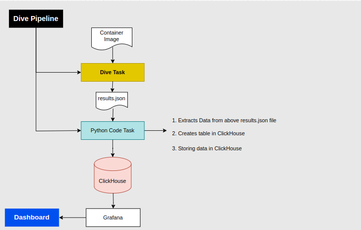

# Dive Tool - Container Image Exploration and Analysis

## Overview

"Dive" is an open-source container image exploration and analysis tool that provides insights into the layers, contents, and changes within Docker images. It helps developers and system administrators understand the composition of images and troubleshoot issues related to image size, layer duplication, and more.

## Architecture



## Features

- Visualize image layers and their sizes.
- Compare images to identify changes and differences between layers.
- View the contents of individual image layers.
- Analyze image history to understand how an image is constructed.
- Detect inefficiencies in image composition to optimize image builds.
- Open-source and actively maintained by the community.

## Getting Started

### Installation

To install "dive," follow these steps:

1. Install Go (if not already installed) - [Go Installation Guide](https://golang.org/doc/install)
2. Run the following command to install "dive":
   ```bash
   go get github.com/wagoodman/dive
   ```
### Usage
1. Build or pull the Docker image you want to analyze.

2. Run "dive" on the image using the following command:

```bash
dive <image_name>
```
Replace <image_name> with the name or ID of the Docker image.

3. Explore the layers, contents, and changes within the image using the interactive interface.

### Example Use Cases
* Identifying redundant files or duplicated layers in images.
* Optimizing image builds by analyzing layer sizes.
* Troubleshooting image composition issues.
* Understanding the impact of changes to Dockerfiles on image layers.

# JSON Data Processing and Database Insertion

This repository contains a script for processing JSON data related to container images, extracting relevant information, and inserting it into a ClickHouse database. The script is designed to help store and analyze efficiency-related metrics of Docker images.

## Prerequisites

- Python 3.x installed
- ClickHouse server accessible
- Required Python libraries installed (see requirements.txt)

## Getting Started

1. Clone this repository or download the script files.

2. Install the required libraries using the provided `requirements.txt` file.

3. Create a `.env` file in the same directory as your script files with the necessary configuration.

4. Ensure that your ClickHouse server is accessible and its connection details are configured.

## Usage

1. Run the script using the provided command.

2. The script will read the JSON data from the specified file, process it, and insert the relevant information into the ClickHouse database.

## Database Configuration

- The script uses the `connect.py` file to configure the ClickHouse database connection.
- Modify the `connect.py` file to provide accurate connection details to your ClickHouse server.

## Data Processing and Insertion

- The script processes JSON data to extract size-related metrics of container images.
- It calculates efficiency scores and inserts the processed data into the ClickHouse database.

## Storing following Data in a ClickHouse DB

The Python script extracts the following data from the JSON data:

   * `Image name` : The name of the Docker image that is being analyzed.
   * `Image size (in bytes)`:  The total size of the image, in bytes. This includes the size of all of the layers in the image, as well as the size of the image metadata.
   * `Inefficient bytes (in bytes)`: The number of bytes in the image that are not needed. This can include unused files, empty folders, and other unnecessary data.
   * `Efficiency score `: A measure of how efficient the image is. The score is calculated by dividing the image size by the size of the image without the inefficient bytes. A score of 1 means that the image is perfectly efficient, while a score of 0 means that the image is completely inefficient.


## Customization

- The script can be customized to handle additional metrics or data points as needed.
- Adjust the database schema in the script to match your data requirements.

## Error Handling

- The script contains error handling mechanisms to catch and display any exceptions that may occur during execution.
- Errors related to JSON decoding, ClickHouse connection, and data insertion are handled.

## Dive Outputs in Grafana


## Conclusion

In conclusion, the "Dive" tool provides a dynamic approach to explore and understand Docker images, helping troubleshoot issues and optimize builds. On the other hand, the JSON Data Processing script offers an effective way to extract image metrics and store them in a robust database.

Both tools, "Dive" and the JSON Data Processing script, contribute to streamlined development, efficient resource utilization, and informed decision-making in containerized environments. By utilizing these tools, you empower your organization to excel in the world of containerization, fostering a culture of collaboration and innovation.