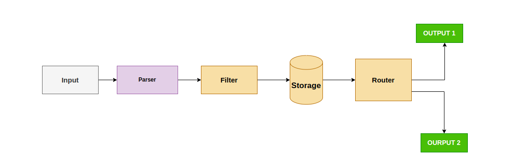
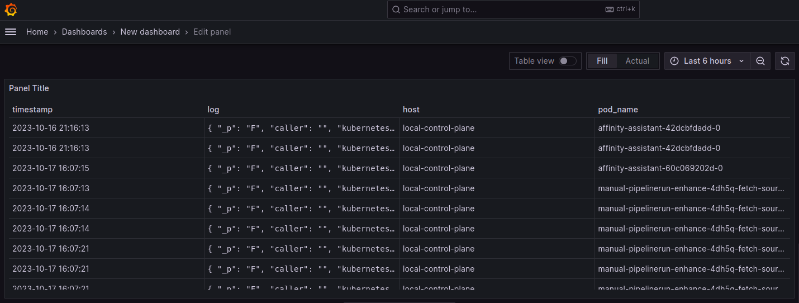

# Fluentbit --> ClickHouse --> Grafana

# Table of Contents

- [Fluentbit --\> ClickHouse --\> Grafana](#fluentbit----clickhouse----grafana)
- [Table of Contents](#table-of-contents)
- [FluentBit](#fluentbit)
  - [Fluent Bit Data Pipeline](#fluent-bit-data-pipeline)
  - [Fluent Bit Helm chart](#fluent-bit-helm-chart)
    - [Installation](#installation)
    - [Chart values](#chart-values)
    - [Using Lua scripts](#using-lua-scripts)
      - [How to use Lua scripts with this Chart](#how-to-use-lua-scripts-with-this-chart)
      - [Note](#note)
    - [Clickhouse Output in FluentBit](#clickhouse-output-in-fluentbit)
    - [Creating a ClickHouse Table](#creating-a-clickhouse-table)
  - [Visualizing the Kubernetes data](#visualizing-the-kubernetes-data)
  - [Reference Links](#reference-links)
  - [Conclusion](#conclusion)


# FluentBit

Fluent Bit is an open-source tool designed for efficiently collecting and processing log data. It was created in 2015 by Treasure Data. This software is particularly well-suited for highly distributed environments where minimizing resource usage (like memory and CPU) is crucial. Fluent Bit is known for its high performance and has a small memory footprint, using only about 450KB. It employs an abstracted I/O handler for asynchronous and event-driven read/write operations, and offers various configuration options for ensuring reliability and resilience in log handling.

## Fluent Bit Data Pipeline
**Fluent Bit** collects and process logs (records) from different input sources and allows to parse and filter these records before they hit the Storage interface. Once data is processed and it's in a safe state (either in memory or the file system), the records are routed through the proper output destinations.



## Fluent Bit Helm chart

[Fluent Bit](https://fluentbit.io) is a fast and lightweight log processor and forwarder or Linux, OSX and BSD family operating systems.

### Installation

To add the `fluent` helm repo, run:

```sh
helm repo add fluent https://fluent.github.io/helm-charts
```

To install a release named `fluent-bit`, run:

```sh
helm install fluent-bit fluent/fluent-bit
```

### Chart values

```sh
helm show values fluent/fluent-bit
```

### Using Lua scripts
Fluent Bit allows us to build filter to modify the incoming records using custom [Lua scripts.](https://docs.fluentbit.io/manual/pipeline/filters/lua)

#### How to use Lua scripts with this Chart

First, you should add your Lua scripts to `luaScripts` in values.yaml

```yaml
luaScripts:
  functions.lua: |
    function set_fields(tag, timestamp, record)
          record['host'] = record['log']['kubernetes']['host']
          record['log']['kubernetes']['host'] = nil
          record['pod_name'] = record['log']['kubernetes']['pod_name']
          record['log']['kubernetes']['pod_name'] = nil
          return 2, timestamp, record
    end
```
This Lua script reorganizes log records from Kubernetes. It extracts and reassigns the `host` and `pod_name` fields for easier access, and then removes the original nested fields to streamline the log record. This helps in processing and storing logs in a more organized format.

After that, the Lua scripts will be ready to be used as filters. So next step is to add your Fluent bit [filter](https://docs.fluentbit.io/manual/concepts/data-pipeline/filter) to `config.filters` in values.yaml, for example:

```yaml
config:
## https://docs.fluentbit.io/manual/pipeline/filters
  filters: |
    
    [FILTER]
        Name kubernetes
        Match kube.*
        Merge_Log On
        Keep_Log Off
        K8S-Logging.Parser On
        K8S-Logging.Exclude On
    
    [FILTER]
        Name nest
        Match *
        Operation nest
        Wildcard *
        Nest_under log

    [FILTER]
        Name lua
        Match *
        script /fluent-bit/scripts/functions.lua
        call set_fields
```

In this Fluent Bit configuration, a series of filters are applied to enhance the handling and structure of logs.

First, there's the **Kubernetes Filter**. This filter is crucial for managing logs originating from Kubernetes environments. It specializes in tasks like handling multi-line logs and parsing out essential information unique to Kubernetes. By merging certain log entries and excluding unnecessary fields, it ensures that the logs are more organized and insightful.

Next, we have the **Nest Filter**. Its purpose is to tidy up log data by grouping related fields together under a common parent field. This helps in keeping the log records well-organized and easy to read.

Finally, the **Lua Filter** introduces an extra layer of customization. It allows for the application of custom Lua scripts to modify log records dynamically. In this specific setup, it calls a function called `set_fields` defined in a Lua script. This function is responsible for extracting and reorganizing crucial fields like `host` and `pod_name`. By applying this Lua script, the logs are tailored to better suit the specific needs of the environment.

Under the hood, the chart will:
- Create a configmap using `luaScripts`.
- Add a volumeMounts for each Lua scripts using the path `/fluent-bit/scripts/<script>`.
- Add the Lua script's configmap as volume to the pod.

#### Note
Remember to set the `script` attribute in the filter using `/fluent-bit/scripts/`, otherwise the file will not be found by fluent bit.

### Clickhouse Output in FluentBit

```yaml
## https://docs.fluentbit.io/manual/pipeline/outputs
outputs: |
  [OUTPUT]
    name http
    tls on
    match *
    host <YOUR CLICKHOUSE CLOUD HOST>
    port 8123
    URI /?query=INSERT+INTO+fluentbit.kube+FORMAT+JSONEachRow
    format json_stream
    json_date_key timestamp
    json_date_format epoch
    http_user default
    http_passwd <YOUR PASSWORD>
```

This configuration block in Fluent Bit sets up an output to send processed log data to a ClickHouse database. It uses TLS for secure communication and specifies the ClickHouse host, port, and URI for data insertion. The logs are formatted as JSON and authentication is provided via a username and password.

### Creating a ClickHouse Table

In the previously discussed Fluent Bit configuration, we included a URI for data insertion. Now, let's proceed to set up the corresponding table in ClickHouse.

Below is the essential information:

```text
URI /?query=INSERT+INTO+fluentbit.kube+FORMAT+JSONEachRow
```

This URI directs Fluent Bit to insert log data into the ClickHouse table named `fluentbit.kube` using the JSONEachRow format. This step is crucial for effectively storing and managing your Kubernetes logs.

If haven't created the Database, So please create it.

```sh
CREATE DATABASE fluentbit
```

After creating the database, we are required to enable the JSON object type via the experimental flag `allow_experimental_object_type`, or in ClickHouse Cloud opening a support case:

```sh
SET allow_experimental_object_type = 1
```

Once set, we can create the table with the provided structure. Note how we specify our primary key via the ORDER BY clause. Explicitly declaring our `host` and `pod_name` columns on the root of the message, rather than relying on ClickHouse to infer them dynamically as simply `String` within the JSON column, allows us to define their types more tightly - for both we use LowCardinality(String) improving their compression and query performance due to reduced IO. We create the usual `log` column which will contain any other fields in the message.

```sh
CREATE TABLE fluentbit.kube
(
    timestamp DateTime,
    log JSON,
    host LowCardinality(String),
    pod_name LowCardinality(String)
)
Engine = MergeTree ORDER BY tuple(host, pod_name, timestamp)
```

Once created, we can deploy Fluent Bit to send our Kubernetes logs.

To confirm successful installation, list the pods in the default namespace. Note your namespace and response may vary in production environments.:

```text
$ kubectl get pods -n qw

NAME                         READY   STATUS    RESTARTS   AGE
fluentbit-fluent-bit-lb5cx   1/1     Running   0          23h
```

After a few minutes we should begin to see logs start to flow to ClickHouse. From the clickhouse-client we perform a simple SELECT. Note the `FORMAT` option is required to return rows in JSON format and we focus on log messages where a host and pod_name could be extracted.

```sh
SET output_format_json_named_tuples_as_objects = 1
SELECT * FROM fluentbit.kube LIMIT 10 FORMAT JSONEachRow
```

```text
clickhouse-client :) SELECT * FROM fluentbit.kube WHERE host != '' AND pod_name != '' LIMIT 2 FORMAT JSONEachRow

SELECT *
FROM fluentbit.kube
WHERE (host != '') AND (pod_name != '')
LIMIT 1
FORMAT JSONEachRow
```

You get the complete log of that Pod.

## Visualizing the Kubernetes data
* You have to configure the Clickhouse as Data Source in Grafana. 



## Reference Links

* [Clickhouse Document](https://clickhouse.com/blog/kubernetes-logs-to-clickhouse-fluent-bit)

## Conclusion

This guide demonstrated how to build an efficient logging pipeline using Fluent Bit, ClickHouse, and Grafana. Fluent Bit's lightweight nature and Lua scripting capabilities enhance log processing. ClickHouse provides a robust storage solution, while Grafana offers powerful visualization tools. This setup ensures effective monitoring and troubleshooting of Kubernetes environments.