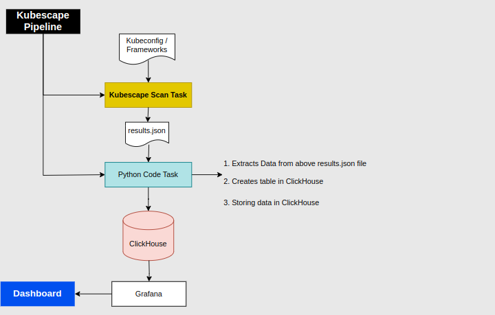

# Kubescape - Kubernetes Cluster Security Scanning Tool

Kubescape is an open-source tool designed to assess the security posture of Kubernetes clusters. It evaluates clusters against multiple security benchmarks, helping you identify potential misconfigurations and vulnerabilities.

## About the Pipeline



## Table of Contents

- [Kubescape - Kubernetes Cluster Security Scanning Tool](#kubescape---kubernetes-cluster-security-scanning-tool)
  - [About the Pipeline](#about-the-pipeline)
  - [Table of Contents](#table-of-contents)
  - [Features](#features)
  - [Prerequisites](#prerequisites)
  - [Installation](#installation)
    - [Usage](#usage)
    - [Integration with CI/CD](#integration-with-cicd)
    - [Customization](#customization)
- [Kubescape Data Processing and ClickHouse Insertion](#kubescape-data-processing-and-clickhouse-insertion)
  - [Prerequisites](#prerequisites-1)
  - [Overview](#overview)
    - [Data Processing (`process_json_data.py`)](#data-processing-process_json_datapy)
    - [ClickHouse Database Interaction (`clickhouse_connect.py`)](#clickhouse-database-interaction-clickhouse_connectpy)
    - [Storing data in ClickHouse DB](#storing-data-in-clickhouse-db)
    - [Main Execution (`main.py`)](#main-execution-mainpy)
  - [Usage](#usage-1)
    - [Customization](#customization-1)
    - [Kubescape scan Results in Grafana](#kubescape-scan-results-in-grafana)
    - [Conclusion](#conclusion)


## Features

- Evaluate Kubernetes clusters against popular security benchmarks.
- Identify misconfigurations, vulnerabilities, and risks.
- Generate detailed reports for analysis and remediation.
- Integration with CI/CD pipelines for automated security testing.
- Customizable to focus on specific checks and benchmarks.

## Prerequisites

- Kubernetes cluster to scan.
- kubectl command-line tool installed and configured.

## Installation

1. Clone the Kubescape repository:
```sh
   git clone https://github.com/armosec/kubescape.git
   cd kubescape
```
1. Run Kubescape using Docker:
   * Ensure that you have the kubectl command-line tool installed and configured to access your Kubernetes cluster.
   * Run the following Docker command to perform a security scan using Kubescape:
   ```bash
   docker run --rm -v ~/.kube:/app/.kube -it armosec/kubescape
   ```
   The -v ~/.kube:/app/.kube option mounts your local ~/.kube directory (which contains your kubeconfig) to the container's /.kube directory, enabling Kubescape to interact with your Kubernetes cluster.
2. Kubescape will perform the security scan on your Kubernetes cluster and generate a report with findings and recommendations.
   
   **Note:** You can customize the scan by providing additional flags, such as specific checks or benchmarks to run. Refer to the official documentation for more details.

### Usage

After completing the installation steps, you can use Kubescape to assess the security posture of your Kubernetes cluster. Run the following command to initiate a security scan:

```sh
kubescape scan --kubeconfig cluster.conf
```

Replace cluster.conf file with your kubeconfig file.

### Integration with CI/CD

You can integrate Kubescape into your CI/CD pipelines to automate security checks for every deployment:

1. Install Kubescape within your CI/CD environment.
2. Use **kubectl** to apply your Kubernetes manifests.
3. Run Kubescape scans using appropriate flags and settings.
4. Parse the generated report for findings and recommendations.
5. Fail the pipeline or trigger alerts based on the scan results.

### Customization

Kubescape offers various customization options to tailor the scan to your needs. You can specify specific checks, benchmarks, or namespaces to scan. Refer to the official documentation for detailed customization instructions.

# Kubescape Data Processing and ClickHouse Insertion

This repository contains a set of scripts designed to process JSON data generated by the Kubescape tool and insert the relevant information into a ClickHouse database. The scripts are intended to help store and analyze security assessment data of Kubernetes clusters.

## Prerequisites

- Python 3.x installed
- Accessible ClickHouse server
- Required Python libraries installed (see requirements.txt)

## Overview

The provided scripts serve the following purposes:

### Data Processing (`process_json_data.py`)

This script processes the JSON data generated by Kubescape. It extracts relevant information such as cluster name, control details, status, scores, and compliance scores. The extracted data is organized and prepared for insertion into the ClickHouse database.

### ClickHouse Database Interaction (`clickhouse_connect.py`)

The `clickhouse_connect.py` script handles the connection to the ClickHouse database. It retrieves connection details from environment variables and establishes a connection to the ClickHouse server. This connection is crucial for inserting processed data into the database.

### Storing data in ClickHouse DB

* `Cluster name`: The name of the Kubernetes cluster that is being scanned.
* `Generation time`: The time at which the scan was generated.
* `Control ID`: The unique identifier for the control that was scanned.
* `Control name`: The name of the control that was scanned.
* `Status`: The status of the control, such as "PASSED", "FAILED", or "NA".
* `Score`: The score for the control, out of 100.
* `Compliance score`: The compliance score for the control, out of 100.
* `Score factor`: The score factor for the control, which is used to calculate the overall compliance score for the cluster.


### Main Execution (`main.py`)

The `main.py` script orchestrates the data processing and ClickHouse insertion. It reads the JSON data from a specified file, processes the data using the `process_json_data` function, and inserts the processed data into the ClickHouse database using the ClickHouse client provided by `clickhouse_connect`.

## Usage

1. Ensure that you have Python 3.x installed on your system.

2. Set up the required environment variables in a `.env` file. These variables include ClickHouse connection details and the path to the JSON data file.

3. Install the necessary Python libraries using the provided `requirements.txt` file:
   ```sh
   pip install -r requirements.txt
   ```
4. Run the main.py script to process the JSON data and insert it into the ClickHouse database:
   ```sh
   python main.py
   ```
### Customization
* Modify the process_json_data function in process_json_data.py to handle additional data points or customize the extraction process.
* Adjust the ClickHouse table schema in main.py based on your data storage requirements.

### Kubescape scan Results in Grafana


### Conclusion

Kubescape is a valuable open-source tool for enhancing Kubernetes cluster security. It efficiently assesses clusters against security benchmarks, pinpointing vulnerabilities and misconfigurations. The tool's integration into CI/CD pipelines automates security checks, and its customization options enable tailored assessments. With clear installation and usage instructions, Kubescape empowers users to bolster their Kubernetes security posture effectively. Additionally, the provided data processing and ClickHouse insertion scripts offer a streamlined way to store and analyze security assessment data, contributing to a comprehensive security strategy.