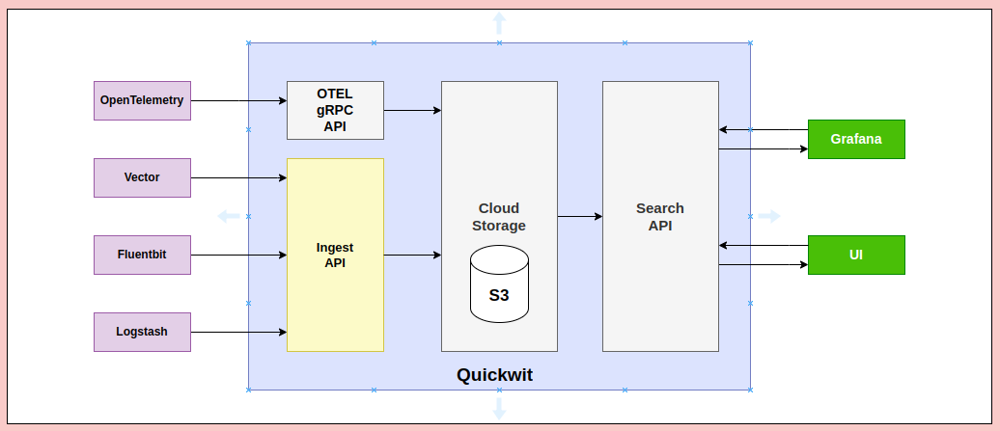
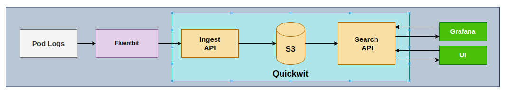
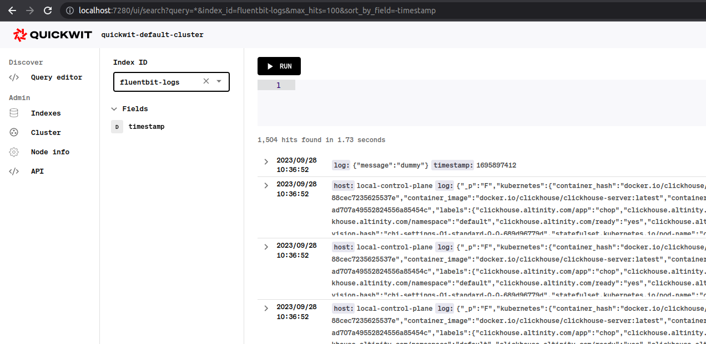
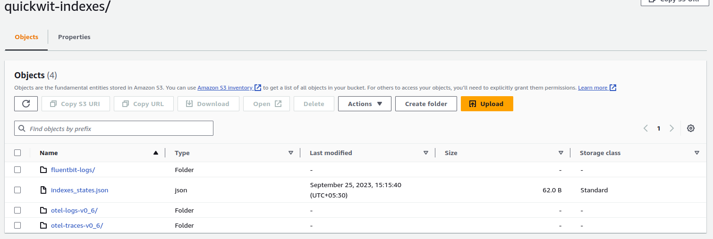
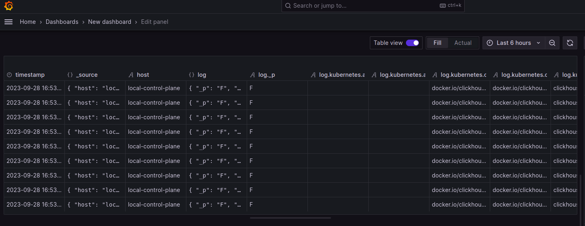
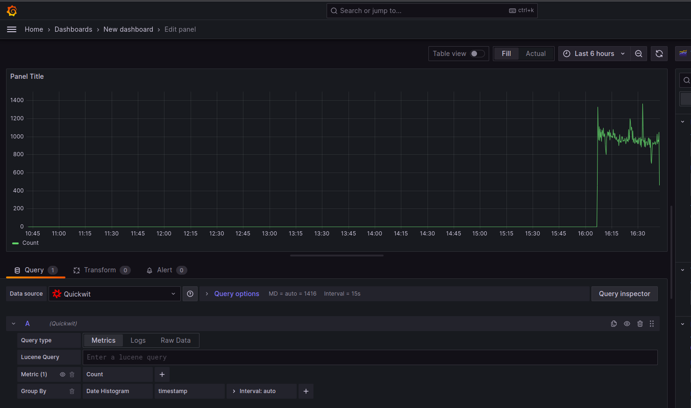

# Getting Started with Quickwit

## Table of Contents

- [Getting Started with Quickwit](#getting-started-with-quickwit)
  - [Table of Contents](#table-of-contents)
  - [What is Quickwit](#what-is-quickwit)
    - [Here are key features of Quickwit](#here-are-key-features-of-quickwit)
  - [Log Management with Quickwit](#log-management-with-quickwit)
- [Log Management in Quickwit using Fluentbit](#log-management-in-quickwit-using-fluentbit)
  - [Setting up Quickwit and Fluentbit](#setting-up-quickwit-and-fluentbit)
    - [What are we getting from above Config?](#what-are-we-getting-from-above-config)
  - [Search Logs](#search-logs)
  - [S3 Storage](#s3-storage)
  - [Grafana Visualization](#grafana-visualization)
      - [Prerequisites](#prerequisites)
      - [Setup Quickwit Datasource](#setup-quickwit-datasource)
        - [Requirements](#requirements)
      - [Grafana Dashboard](#grafana-dashboard)
  - [Reference URLs:](#reference-urls)
  - [Conclusion:](#conclusion)


## What is Quickwit

**Quickwit** is an open-source search engine designed for building search applications. It's specifically designed for applications with large-scale indexing needs and distributed search capabilities. Quickwit is built to be flexible, high-performance, and easy to scale.

### Here are key features of Quickwit

**Distributed Search**: Quickwit allows you to distribute your search infrastructure across multiple nodes, enabling you to handle large datasets and high query volumes.

**Efficient Indexing**: It supports efficient indexing of large-scale datasets with features like sharding and parallelism.

**Schema Flexibility**: Quickwit is schema-agnostic, meaning you don't need to pre-define your data schema. It adapts to your data on-the-fly.

**Real-time Ingestion**: It supports real-time data ingestion, allowing your search results to be up-to-date with your data sources.

**RESTful API and gRPC Interface**: Quickwit provides both RESTful API and gRPC interfaces, making it versatile and suitable for various application architectures.

**Built-in Query Language**: It comes with a query language that supports features like full-text search, faceting, and filtering.

## Log Management with Quickwit

Log management is a critical aspect of maintaining robust and efficient systems. Quickwit simplifies this process by seamlessly integrating with popular log agents like OpenTelemetry (OTEL) Collector, Vector, Fluentbit, and Logstash.



**OpenTelemetry (OTEL) Collector:**
OTEL Collector is a versatile agent capable of collecting logs from various sources. Configured to transform and send logs to Quickwit, it streamlines the process of log ingestion and indexing.

**Vector:**
Vector is a high-performance, open-source log agent with support for a wide range of sources and destinations. By configuring Vector to collect logs and forward them to Quickwit, you can ensure efficient log management.

**Fluentbit:**
Fluentbit is a lightweight and efficient log collector that excels in environments where resource usage is a concern. It can be configured to gather logs from diverse sources and send them to Quickwit for indexing.

**Logstash:**
While not explicitly mentioned, Logstash remains a viable option for log collection. It can be configured to seamlessly send logs to Quickwit for comprehensive log management.

# Log Management in Quickwit using Fluentbit



## Setting up Quickwit and Fluentbit
* Deploy Quickwit
* Create fluentbit Index in Quickwit
* Deploy Fluentbit

1. **Install Quickwit**
```yaml
apiVersion: apps/v1
kind: Deployment
metadata:
  name: quickwit
spec:
  replicas: 1
  selector:
    matchLabels:
      app: quickwit
  template:
    metadata:
      labels:
        app: quickwit
    spec:
      volumes:
        - name: config-volume
          configMap:
            name: quickwit-config  # Name of the ConfigMap
      containers:
        - name: quickwit
          image: quickwit/quickwit:latest
          command: ["quickwit", "run"]  # Added command to run Quickwit
          ports:
            - containerPort: 7280  # Add this line to expose port 7280
            - containerPort: 7281  # Add this line to expose port 7281          
          volumeMounts:
            - name: config-volume
              mountPath: /quickwit/config  # Mount path inside the container
          env:
            - name: QW_CONFIG
              value: /quickwit/config/quickwit.yaml
---
apiVersion: v1
kind: Service
metadata:
  name: quickwit
spec:
  selector:
    app: quickwit
  ports:
    - protocol: TCP
      port: 7280
      targetPort: 7280
      nodePort: 30080  # Define a NodePort for port 7280
      name: restapi
    - protocol: TCP
      port: 7281
      targetPort: 7281
      nodePort: 30081  # Define a NodePort for port 7281
      name: grpc
  type: NodePort  # Change service type to NodePort
---
apiVersion: v1
data:
  quickwit.yaml: |
    # -------------------------------- General settings --------------------------------
    version: 0.6
    default_index_root_uri: s3://<Bucket Name>/quickwit-indexes
    storage:
      s3:
        endpoint: "https://s3.us-east-1.amazonaws.com"
        region: us-east-1
        access_key_id: ""
        secret_access_key: ""

    indexer:
      enable_otlp_endpoint: true

    jaeger:
      enable_endpoint: ${QW_ENABLE_JAEGER_ENDPOINT:-true}
kind: ConfigMap
metadata:
  name: quickwit-config
```
**Note:** Please provide your **S3 Storage** details in above configmap.

```sh
kubectl create -f <file name> -n <Namespace>
```

2. **Create a simple index for Fluentbit logs**

Add below yaml file in fluentbit-logs.yaml file.

```yaml

version: 0.6

index_id: fluentbit-logs

doc_mapping:
  mode: dynamic
  field_mappings:
    - name: timestamp
      type: datetime
      input_formats:
        - unix_timestamp
      output_format: unix_timestamp_secs
      fast: true
  timestamp_field: timestamp

indexing_settings:
  commit_timeout_secs: 10
```

And then create the index with cURL:
```bash
curl -XPOST http://<QUICKWIT URL>:7280/api/v1/indexes -H "content-type: application/yaml" --data-binary @fluentbit-logs.yaml
```

Fluentbit configuration file is made of inputs and outputs. For this tutorial, we will use a dummy configuration:

```text
[INPUT]
  Name   dummy
  Tag    dummy.log
```

* **Name:** Specifies the input plugin to be used. In this case, it's using the dummy plugin, which generates dummy log data.

* **Tag:** Tags are used to categorize logs. In this case, the tag dummy.log is assigned to the generated dummy logs.

```text
[OUTPUT]
  Name http
  Match *
  URI   /api/v1/fluentbit-logs/ingest
  Host  <quickwit-service>.<Namespace>.svc.cluster.local
  Port  7280
  tls   Off
  Format json_lines
  Json_date_key    timestamp
  Json_date_format epoch
```
* **Name:** Specifies the output plugin to be used. In this case, it's using the http plugin, which allows Fluentbit to send logs over HTTP.
* **Match \*:** Defines the pattern for which logs should be sent to this output. In this case, * is a wildcard, meaning all logs will be sent.
* **URI:** The endpoint where the logs will be sent. In this example, logs will be sent to /api/v1/fluentbit-logs/ingest.
* **Host and Port:** Specify the destination address and port for the HTTP request. In this case, it's localhost and port 7280.
* **tls:** Indicates whether Transport Layer Security (TLS) is enabled or not. In this example, it's set to Off, meaning no encryption is used.
* **Format:** Specifies the format in which logs will be sent. In this case, it's using json_lines, which is a JSON format.
* **Json_date_key and Json_date_format:** These settings are specific to the JSON format. They define how timestamps are handled in the JSON logs.

### What are we getting from above Config?

In this configuration, generating dummy logs and sending them to a specified endpoint (/api/v1/fluentbit-logs/ingest). These logs will be sent in JSON format over HTTP to the designated address (quickwit.namespace.svc.cluster.local:7280). The logs will contain a timestamp, along with other dummy data generated by the dummy plugin.

3. **Install Fluentbit**

**Installing with Helm Chart**

```shell
helm repo add fluent https://fluent.github.io/helm-charts
helm upgrade --install fluent-bit fluent/fluent-bit --values <values.yaml>
```

**Note**: Please add the INPUT and OUTPUT configuration in values.yaml and install Fluent-bit.


## Search Logs

Quickwit is now ingesting logs coming from Fluentbit and you can search them either with curl or by using the UI:

```sh
curl "http://127.0.0.1:7280/api/v1/fluentbit-logs/search?query=severity:DEBUG"
```

Open your browser at http://127.0.0.1:7280/ui/search?query=severity:DEBUG&index_id=fluentbit-logs&max_hits=10.

**Note:** Port forward or expose the Quickwit service then search the logs in Browser.



## S3 Storage

Once Quickwit and Fluentbit are properly configured and integrated, you will be able to observe the logs seamlessly flowing into your designated S3 bucket for storage and further analysis.



## Grafana Visualization

#### Prerequisites
* Install Grafana
* Setup Quickwit Datasource in Grafana

#### Setup Quickwit Datasource

##### Requirements

* HTTP URL: Quickwit host (example: http://quickwit.default.svc.cluster.local:7280/api/v1)
* Index settings: 
  * Index ID: fluentbit-logs
  * Timestamp Field: timestamp

#### Grafana Dashboard




## Reference URLs:
[Quickwit Documentation](https://quickwit.io/docs)
[Fluentbit Documentation](https://quickwit.io/docs/log-management/send-logs/using-fluentbit)


## Conclusion:

Incorporating Quickwit into your log management pipeline brings forth a powerful search engine capable of handling large-scale indexing and distributed search needs. With seamless integration options for popular log agents like OpenTelemetry (OTEL) Collector, Vector, Fluentbit, and Logstash, Quickwit ensures efficient log ingestion and indexing. By following the steps outlined in this guide, you've set up a robust log management system that not only enables real-time data ingestion but also provides flexible querying capabilities. With the ability to effortlessly visualize logs in Grafana, you have a comprehensive solution at your disposal for effective log management.