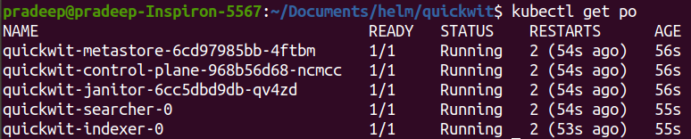
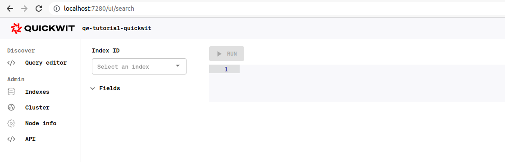
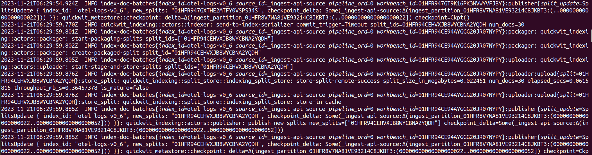
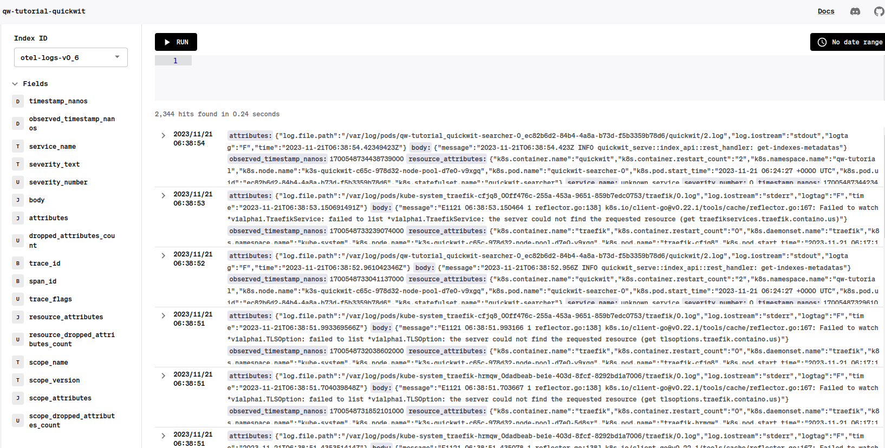
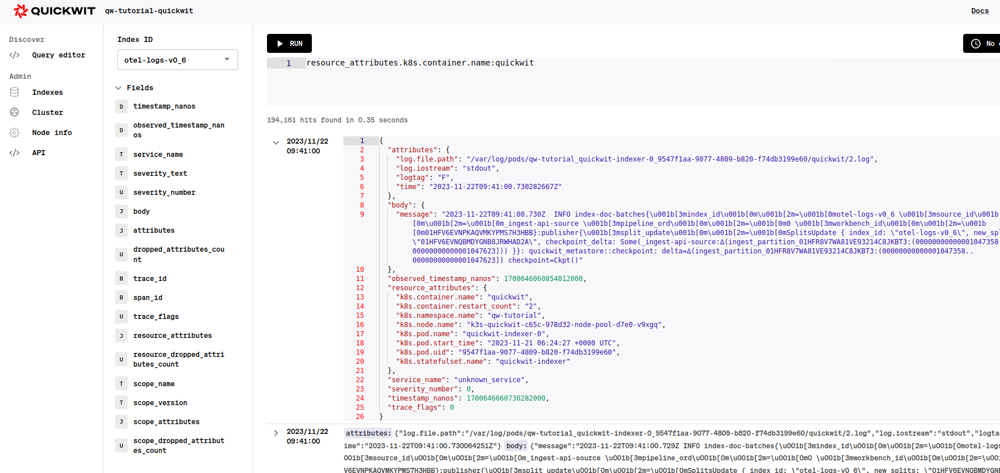

# Send Kubernetes logs using OTEL collector to Quickwit

## Table of Contents

- [Send Kubernetes logs using OTEL collector to Quickwit](#send-kubernetes-logs-using-otel-collector-to-quickwit)
  - [Table of Contents](#table-of-contents)
  - [Prerequisites](#prerequisites)
- [Install Quickwit and Opentelemetry using Helm.](#install-quickwit-and-opentelemetry-using-helm)
  - [Now Deploying Quickwit](#now-deploying-quickwit)
  - [Now Deploying the OTEL Collector](#now-deploying-the-otel-collector)
  - [Now we are ready to search the logs in Search UI of Quickwit.](#now-we-are-ready-to-search-the-logs-in-search-ui-of-quickwit)
- [Clean up](#clean-up)
- [Reference Links](#reference-links)
- [Conclusion](#conclusion)


## Prerequisites

* A Kubernetes cluster.
* The command line tool kubectl.
* The command line tool Helm.
* An access to an object storage like AWS S3.

# Install Quickwit and Opentelemetry using Helm.

We will proceed with a Isolated Namespace to isolate our setup and set it as the default namespace.

```shell
kubectl create namespace qw-tutorial
kubectl config set-context --current --namespace=quickwit
```

Then let's add Quickwit and Otel helm repositories:

```shell
helm repo add quickwit https://helm.quickwit.io
helm repo add open-telemetry https://open-telemetry.github.io/opentelemetry-helm-charts
```

You should now see the two repos in helm repos:

```txt
helm repo list
NAME                    URL
quickwit                https://helm.quickwit.io
open-telemetry          https://open-telemetry.github.io/opentelemetry-helm-charts
```

## Now Deploying Quickwit

Here we will use basic chart configuration. Setup the AWS configure values in the local by exporting ENV variables.

```shell
export AWS_REGION=<aws region ex: us-east-1>
export AWS_ACCESS_KEY_ID=XXXX
export AWS_SECRET_ACCESS_KEY=XXXX
export DEFAULT_INDEX_ROOT_URI=s3://your-bucket/indexes
```

Now create the Quickwit configure file

```shell
# Create Quickwit config file.
echo "
searcher:
  replicaCount: 1
indexer:
  replicaCount: 1
metastore:
  replicaCount: 1
janitor:
  enabled: true
control_plane:
  enabled: true

environment:
  # Remove ANSI colors.
  NO_COLOR: 1

# Quickwit configuration
config:
  # No metastore configuration.
  # By default, metadata is stored on the local disk of the metastore instance.
  # Everything will be lost after a metastore restart.
  s3:
    region: ${AWS_REGION}
    access_key: ${AWS_ACCESS_KEY_ID}
    secret_key: ${AWS_SECRET_ACCESS_KEY}
  default_index_root_uri: ${DEFAULT_INDEX_ROOT_URI}

  # Indexer settings
  indexer:
    # By activating the OTEL service, Quickwit will be able
    # to receive gRPC requests from OTEL collectors.
    enable_otlp_endpoint: true
" > quickwit-values.yaml
```

Now run the helm install command

```shell
helm install quickwit quickwit/quickwit -f quickwit-values.yaml
```

You will see the pods running Quickwit services:



Let's check Quickwit is working by port-forwarding the service:

```shell
kubectl port-forward svc/quickwit-searcher 7280
```

Then open your browser http://localhost:7280/ui/. You can see the list of indexes. Keep the kubectl command running and open a new terminal.

You will see the Quickwit Searcher UI like below.



## Now Deploying the OTEL Collector

We need to configure the collectors in order to:

* collect logs from k8s
* enrich the logs with k8s attributes
* export the logs to Quickwit indexer.

We can use the below basic values to setup the OTEL. 

```shell
echo "
mode: daemonset
presets:
  logsCollection:
    enabled: true
  kubernetesAttributes:
    enabled: true
config:
  exporters:
    otlp:
      endpoint: quickwit-indexer.qw-tutorial.svc.cluster.local:7281
      # Quickwit OTEL gRPC endpoint does not support compression yet.
      compression: none
      tls:
        insecure: true
  service:
    pipelines:
      logs:
        exporters:
          - otlp
" > otel-values.yaml
```

Now run the below helm install command to install the OTEL.

```shell
helm install otel-collector open-telemetry/opentelemetry-collector -f otel-values.yaml
```

You can see logs on your indexer that show indexing has started like below.



## Now we are ready to search the logs in Search UI of Quickwit.

**Example of queries:**

* body.message:quickwit
* resource_attributes.k8s.container.name:quickwit
* resource_attributes.k8s.container.restart_count:1





# Clean up

Let's first delete the indexes and then uninstall the charts we deployed on Cluster.

```shell
# Delete the index. The command will return the list of delete split files.
curl -XDELETE http://127.0.0.1:7280/api/v1/indexes/otel-logs-v0

# Uninstall charts
helm delete otel-collector
helm delete quickwit

# Delete namespace
kubectl delete namespace quickwit
```

# Reference Links

[Quickwit](https://quickwit.io/docs/log-management/send-logs/using-otel-collector-with-helm)

# Conclusion

This guide demonstrated setting up Quickwit and OpenTelemetry for efficient Kubernetes log management. Quickwit's user-friendly interface and powerful querying, coupled with OTEL's log collection and export capabilities, streamline log handling and analysis.

Integrating Quickwit and OTEL enhances Kubernetes log monitoring, fostering better system observability and troubleshooting. This setup empowers informed decision-making and system optimization within Kubernetes environments.