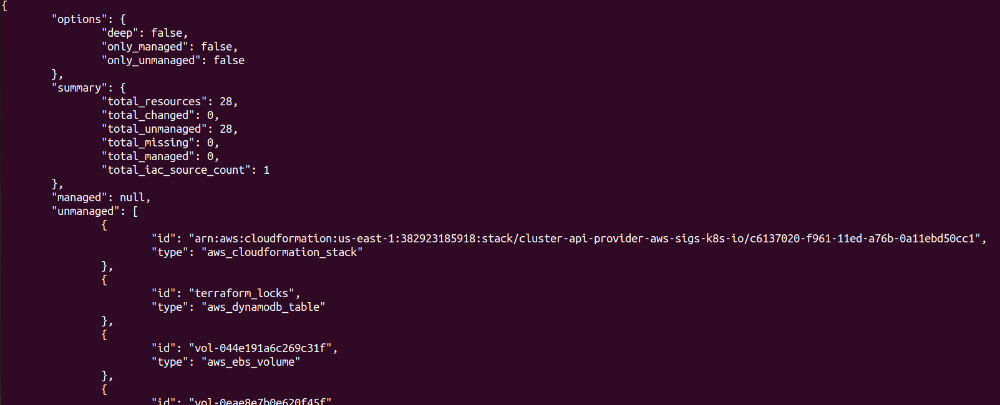

# Bridging the Gap: Managing Drift in Your Terraform Deployments with Driftctl

Terraform is an incredibly powerful tool for managing cloud infrastructure, but ensuring that your deployed resources match your intended state can be a challenge. This is where `driftctl` comes into play. `driftctl` is a command-line interface (CLI) tool designed to detect drift in your cloud infrastructure and bring resources back into compliance with your Terraform configurations. In this blog post, we'll explore what `driftctl` is, why it's important, and how you can integrate it into your Terraform workflows.

## Understanding Drift in Terraform

Drift refers to the difference between the expected state of your infrastructure (as defined in your Terraform configuration files) and the actual state of your deployed resources in your cloud provider. This can occur due to manual changes, external automation, or other factors. Detecting and managing drift is crucial for maintaining a stable and secure infrastructure.

## What is Driftctl?

`driftctl` is a powerful tool that helps you identify and manage drift in your Terraform deployments. It scans your cloud resources and compares their current state with the state defined in your Terraform state file. This enables you to quickly identify any discrepancies and take corrective action.

## Key Features

### 1. Drift Detection

`driftctl` provides a comprehensive scan of your cloud infrastructure, highlighting any resources that have drifted from their intended state. This allows you to address issues before they lead to potential problems or security vulnerabilities.

---
title: "Driftctl"
date: 2023-11-16
draft: false
description: "The tool compares the actual state of your resources in the cloud provider with the state described in your Terraform state file. This detailed comparison helps you pinpoint specific resources that require attention."
weight: 5
---

### 2. State Comparison

The tool compares the actual state of your resources in the cloud provider with the state described in your Terraform state file. This detailed comparison helps you pinpoint specific resources that require attention.

### 3. Reporting and Alerts

`driftctl` offers reporting capabilities that provide a clear overview of detected drift. It can also generate alerts, enabling you to take timely action to rectify any discrepancies.

### 4. Integration with CI/CD

You can seamlessly integrate `driftctl` into your CI/CD pipelines. This allows you to perform drift detection as part of your deployment process, ensuring that your infrastructure remains in compliance with your Terraform configurations.

### 5. Multi-Cloud Support

`driftctl` supports multiple cloud providers, including AWS, Azure, Google Cloud Platform, and more. This makes it a versatile tool for managing drift in a variety of environments.

## Getting Started with Driftctl

### Installation

To get started with `driftctl`, visit the official GitHub repository at [https://github.com/snyk/driftctl](https://github.com/cloudskiff/driftctl) for installation instructions.

### Running Driftctl

Once installed, running `driftctl` is as simple as executing:

```bash
driftctl scan
```

This command will initiate a scan of your cloud resources and generate a detailed report on detected drift.

**You can observe the output as follows:**

## Conclusion

Managing drift is a critical aspect of maintaining a stable and secure cloud infrastructure. `driftctl` provides an invaluable toolset for identifying and addressing discrepancies between your Terraform configurations and deployed resources. By integrating `driftctl` into your workflow, you can ensure that your infrastructure remains in compliance with your intended state.

Start using `driftctl` today and take control of your Terraform deployments!

---

*Note: Always ensure you have the latest version of `driftctl` and refer to the official documentation for the most up-to-date information and best practices.*
