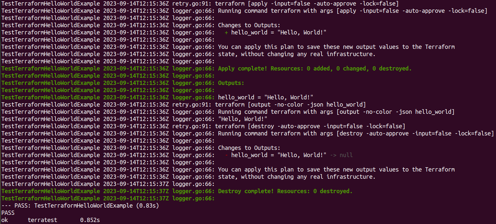

# Automating Infrastructure Testing with Terratest

Infrastructure as Code (IaC) has transformed the way we manage and deploy cloud resources. However, ensuring that your IaC templates work as expected is crucial. This is where automated testing comes into play, and one of the most powerful tools for this job is Terratest. In this blog post, we'll delve into what Terratest is, why it's essential, and how you can leverage its capabilities to supercharge your infrastructure testing.

## What is Terratest?

Terratest is a Go library designed to facilitate automated testing of your infrastructure code, especially when working with Terraform. It provides a rich set of helper functions and utilities that streamline the process of writing and executing tests for your infrastructure.

## Why Use Terratest?

### 1. **End-to-End Testing**

Terratest allows you to perform end-to-end tests on your infrastructure code. This means you can spin up actual resources, apply your Terraform configurations, and validate that everything works as expected.

### 2. **Support for Multiple Cloud Providers**

Terratest is cloud-agnostic and supports various cloud providers like AWS, Azure, Google Cloud, and more. This flexibility ensures that you can test your infrastructure code regardless of the cloud platform you're using.

### 3. **Parallel Test Execution**

With Terratest, you can run tests in parallel, which significantly reduces the time it takes to validate your infrastructure. This is especially valuable when you have a large number of tests to execute.

### 4. **Integration with Testing Frameworks**

Terratest integrates seamlessly with popular testing frameworks like Go's testing package and others. This means you can incorporate infrastructure tests into your existing testing workflow.

## Getting Started with Terratest

### Installation

Getting started with Terratest is straightforward. Begin by installing the Go programming language, as Terratest is a Go library. Next, install Terratest using the `go get` command:

```bash
go get github.com/gruntwork-io/terratest/modules/terratest
```

### Using Terratest with a Simple Terraform Module

Let's walk through an example of using Terratest with a simple Terraform module that outputs "Hello, World!".

```hcl
terraform {
  required_version = ">= 0.12.26"
}

output "hello_world" {
  value = "Hello, World!"
}
```
In this Terraform module, we define an output called hello_world that simply returns the string "Hello, World!".

Now, let's create a Terratest to validate this Terraform module:

```go
package test

import (
	"testing"

	"github.com/gruntwork-io/terratest/modules/terraform"
	"github.com/stretchr/testify/assert"
)

func TestTerraformHelloWorldExample(t *testing.T) {
	// retryable errors in terraform testing.
	terraformOptions := terraform.WithDefaultRetryableErrors(t, &terraform.Options{
		TerraformDir: "./",
	})

	defer terraform.Destroy(t, terraformOptions)

	terraform.InitAndApply(t, terraformOptions)

	output := terraform.Output(t, terraformOptions, "hello_world")
	assert.Equal(t, "Hello, World!", output)
}
```

In this example, we're using Terratest to validate the Terraform module. It initializes and applies the Terraform configuration, retrieves the output, and asserts that it equals "Hello, World!".

**You can observe the test results as follows:**

This is a simple example, but it demonstrates how you can use Terratest to automate the testing of your Terraform modules.

## Conclusion

Terratest is a powerful tool for automating the testing of your infrastructure code. Its support for multiple cloud providers, parallel test execution, and seamless integration with testing frameworks make it an invaluable asset in your testing toolkit.

By incorporating Terratest into your workflow, you can ensure that your infrastructure code is reliable, robust, and ready for production.

---

*Note: Always refer to the official Terratest documentation for the latest information and best practices.*
