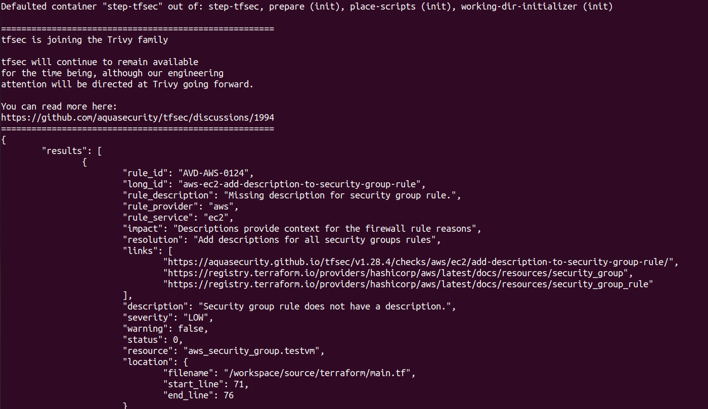

# Exploring Terraform Security with tfsec

Terraform has become an essential tool for managing cloud infrastructure as code, but ensuring the security of your Terraform configurations is equally crucial. This is where `tfsec` comes into play. `tfsec` is a powerful static analysis tool designed specifically for Terraform code. In this blog post, we'll delve into what `tfsec` is, why it's important, and how you can leverage it to enhance the security of your Terraform deployments.

## What is tfsec?

`tfsec` is a lightweight yet robust security scanner for Terraform. It analyzes your Terraform code to identify potential security vulnerabilities, misconfigurations, and adherence to best practices. The tool is designed to catch issues early in the development process, helping you build more secure infrastructure from the ground up.

## Key Features

### 1. Security Scanning

One of `tfsec`'s primary functions is to scan your Terraform code for security vulnerabilities. It examines your configurations for potential risks that could lead to security breaches or compliance violations.

### 2. Best Practice Checks

In addition to security checks, `tfsec` provides recommendations for adhering to best practices in Terraform development. This includes suggestions on code structure, naming conventions, and resource configurations.

### 3. Comprehensive Ruleset

`tfsec` comes with an extensive set of predefined rules covering multiple cloud providers, including AWS, Azure, Google Cloud Platform, and more. This ensures that you can apply security checks and best practices across a wide range of environments.

### 4. Custom Rule Support

You have the flexibility to define custom rules in `tfsec` to enforce specific policies or requirements unique to your organization or project. This allows you to tailor the tool to your specific needs.

### 5. Easy Integration

`tfsec` can be seamlessly integrated into your CI/CD pipelines, providing automated security checks as part of your deployment process. This helps catch issues early and ensures that only secure configurations are deployed.

## Getting Started with tfsec

Using `tfsec` is straightforward. Begin by installing the tool, which is available for various platforms including Linux, macOS, and Windows. Once installed, simply run `tfsec` against your Terraform codebase, and it will provide a detailed report highlighting any identified issues.

```bash
tfsec .
```
**You can observe the output as follows:**


## Conclusion

`tfsec` is a valuable addition to any Terraform developer's toolkit. By incorporating static analysis into your development workflow, you can identify and address potential security risks early in the process, reducing the likelihood of security incidents in your infrastructure.

Remember, while `tfsec` is a powerful tool, it's just one component of a comprehensive security strategy. It should be used in conjunction with other best practices, such as regular security audits, thorough testing, and continuous monitoring.

To get started with `tfsec`, visit the official GitHub repository at [https://github.com/aquasecurity/tfsec](https://github.com/aquasecurity/tfsec) and start enhancing the security of your Terraform deployments today.

---

*Note: Always ensure you have the latest version of `tfsec` and refer to the official documentation for the most up-to-date information and best practices.*

