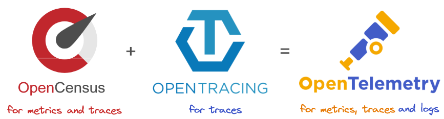
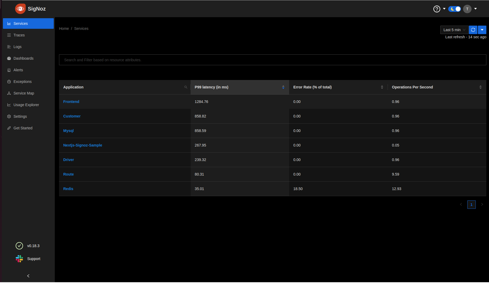
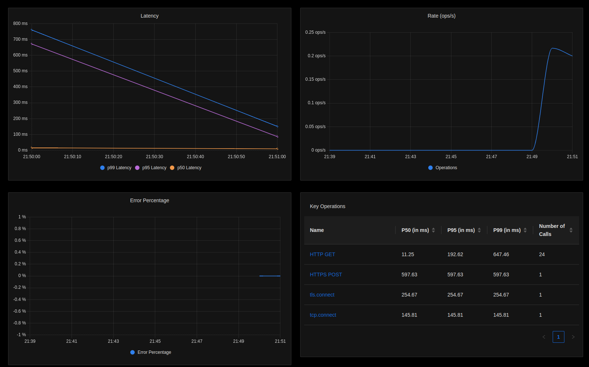
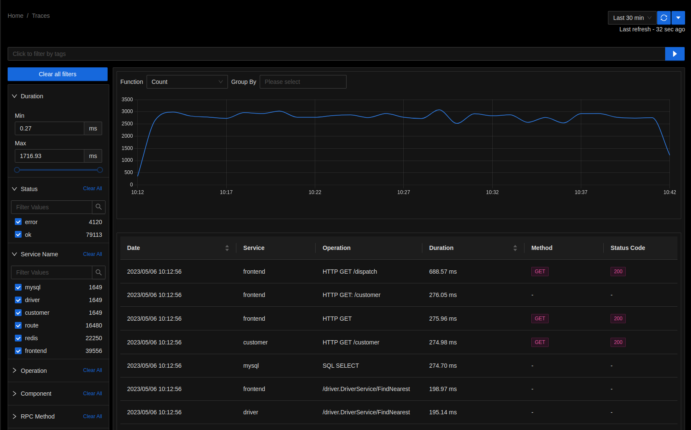

Though Next.js has its own monitoring feature, it does not have end-to-end monitoring and no tracing of database calls this is when OpenTelemetry comes into the picture. Okay so we have the telemetry data but how and where do you analyze it? which is why you need Signoz.
________________

# OpenTelemetry and Signoz and how to install them?

### OpenTelemetry
OpenTelemetry is a open-source project which was hosted by CNCF. It provides a standard way to generate telemetry data - data like logs, metrics, events and also traces which are all created by your applications.



It might not look all that useful when you started your application as a set of microservices, but as the usage of your application increases and time comes for you to scale up, keeping track of all the microservices, their bugs and other metrics becomes difficult. For all that you need OpenTelemetry, be it logs, metrics, or just traces OpenTelemetry provides a single standard for observability, you can store, visualize and query data with the help of SDKs, APIs and othertools.

#### OpenTelemetry can also:
* Provide support for both automatic and manual instrumentation.
* Provide end-to-end implementations to genrate, collect, emit, process and export telemetry data.
* Supports multiple context propagation formats parallelly. 
* Provides a pluggable architecture so that other formats and protocols can be added easily. 

> **NOTE**: Opentelemetry does not provide <u>back-end observability</u> like Jaeger or Prometheus. Also, it only supports `server-side instrumentation`.

### Signoz
Signoz is an analysis tool for backend and it is also a full-stack open-source APM tool for all the data from OpenTelemetry. It helps in providing query and visualization capabilities for the end-user and allows you to keep track of your applications metrics and traces in one place. So, if you want to store and view metrics of the data collected by OpenTelemetry then you'll have to install Signoz.

## Signoz Installation

> **NOTE**: Signoz is only supported in Linux and macOs machines. As of now Windows does not officially support Signoz.

Run the script below - this automatically installs Docker engine too on Linux but if you are on macOS you'll have to install Docker seperately.

```bash
git clone -b main https://github.com/SigNoz/signoz.git
cd signoz/deploy/
./install.sh
```
Now that Signoz has been successfully installed on your local machine you can access it at `http://localhost:3301`

Before you install OpenTelemetry just run your Next.js application

### Running your sample Next.js application
If you already have a next js application, uyou can run it using <mark>npm run dev</mark> if you need help with creating a Nextjs application you can refer to [Next.js 101](https://capten.ai/learning-center/8-internal-guidelines/learn-nextjs/creating-frontend-application-in-nextjs/). You should be seeing your Next.js app running on `http://localhost:3000`

## OpenTelemetry Installation:
<strong>Step 1: Install packages

In your Next.js application install OpenTelemetry packages 

```bash
npm install @opentelemetry/sdk-node
npm install @opentelemetry/auto-instrumentations-node
npm install @opentelemetry/exporter-trace-otlp-http
npm install @opentelemetry/resources
npm install @opentelemetry/semantic-conventions
```
<strong>Step 2: Create a <mark>tracing.js</mark> file

```js
//reference: https://signoz.io/blog/opentelemetry-nextjs/
'use strict'

const opentelemetry = require('@opentelemetry/sdk-node');
const { getNodeAutoInstrumentations } = require('@opentelemetry/auto-instrumentations-node');
const { OTLPTraceExporter } = require('@opentelemetry/exporter-trace-otlp-http');


const { Resource } = require('@opentelemetry/resources');
const { SemanticResourceAttributes } = require('@opentelemetry/semantic-conventions');

// custom nextjs server
const { startServer } = require('./server');

// configure the SDK to export telemetry data to the console
// enable all auto-instrumentations from the meta package
const exporterOptions = {
  url: 'http://localhost:4318/v1/traces',
 }
const traceExporter = new OTLPTraceExporter(exporterOptions);
const sdk = new opentelemetry.NodeSDK({
  resource: new Resource({
    [SemanticResourceAttributes.SERVICE_NAME]: 'Nextjs-Signoz-Sample'
  }),
  traceExporter,
  instrumentations: [getNodeAutoInstrumentations()]
});

// initialize the SDK and register with the OpenTelemetry API
// it allows the API to record telemetry
sdk.start()

// gracefully shut down the SDK on process exit
process.on('SIGTERM', () => {
  sdk.shutdown()
    .then(() => console.log('Tracing terminated'))
    .catch((error) => console.log('Error terminating tracing', error))
    .finally(() => process.exit(0));
});

module.exports = sdk
```
<strong>Step 3: Create a <mark>server.js</mark> file : this is the file that we imported into the <mark>tracing.js</mark> file

```js
//reference: https://signoz.io/blog/opentelemetry-nextjs/
const { createServer } = require("http")
const { parse } = require("url")
const next = require("next")

const dev = process.env.NODE_ENV !== "production"
const app = next({ dev })
const handle = app.getRequestHandler()

module.exports = {
  startServer: async function startServer() {
    return app.prepare().then(() => {
      createServer((req, res) => {
        const parsedUrl = parse(req.url, true)
        handle(req, res, parsedUrl)
      }).listen(8080, (err) => {
        if (err) throw err
        console.log("> Ready on http://localhost:8080")
      })
    })
  },
}
```
<strong>Step 4: To start your server now you have to add a script

To add script > Go to package.json > now add <mark>npm run start:server</mark> your package.json will look something like: 

```json
"scripts": {
    "dev": "next dev",
    "build": "next build",
    "start:server": "node tracing.js",
    "lint": "next lint"
  }
  ```
For the final step run the server

<strong>Step 5: Run the server to monitor your application

Run <mark>npm run start:server</mark>, by default your application will be available on `http://localhost:8080`.

> **NOTE**: If your port is already in use make sure you use a different port number or you can also kill the port. 

```bash
# Use the following commands: 
- sudo lsof -i:<portnumber>
- kill -9 <PID> where PID is your process id.
```

Now hit your URL a few times for dummy data and wait for your application name to be visible - you should already be seeing 



Click on your applications name, here it will be <mark>Nextjs-Signoz-Sample</mark> to view the dashboard and monitor your applications metrics like latency, number of requests per second(rpc), percentage of error.



To visualize how user requests perform across services in a multi-service application you need tracing data captured by OpenTelemetry - Go to <mark>Traces</mark> tab in Signoz



# Conclusion
We can see how OpenTelemetry can be used to instrument your Nextjs applications for end-to-end tracing and how you can use Signoz to keep track of the metrics collected by OpenTelemetry for the smooth performance of your application. For more detailed information you can look at the blog on [Monitoring your Nextjs application using OpenTelemetry](https://signoz.io/blog/opentelemetry-nextjs/). They have a very detailed information on Signoz and OpenTelementry and multiple installation methods.