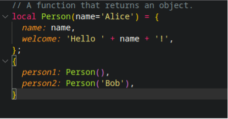
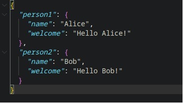
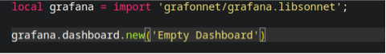

Before taking of our journey with Jsonnet,let's first learn about JSON format.

**JSON (JavaScript Object Notation)**  is a lightweight data interchange format that is easy for humans to read and write and easy for machines to parse and generate. It is widely used for transmitting data between web applications and APIs. JSON is a simple key-value pair format with a basic syntax.

#### Jsonnet

Jsonnet is a data templating language designed to make it easier to manage and generate complex JSON data structures. It is a superset of JSON and provides additional functionality such as variables, conditionals, functions, and imports. Jsonnet allows you to write more concise and reusable code by providing a way to factor out common data and expressions into reusable components.

Now Let's what are the differences in Jsonnet and Grafonnet

#### Example Usage Of Jsonnet And Grafonnet

**Let's generate JSON using Jsonnet** .

 . 

***This jsonnet code Will generate json code like below***

 . 

>  As you can see jsonnet is a templating language that can generate json with logical expression
make generating dynamic json more easier 

On the other hand grafonnet is more specific for designing grafana dashboard it is still able to do
what jsonnet do but with addition built in function to generate grafana dashboard.

 . 

***The above code will generate new json for grafana dashboard like this***

