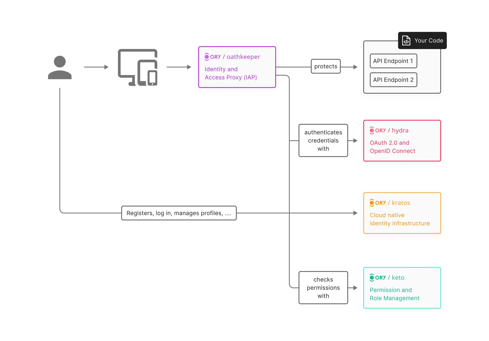

Recent studies show that cyber attacks have been rated fifth from the top as a risk in the recent years. Did you know that there is a hacker attack every 38 seconds? Strong authentication measures can significantly reduce the risk of cyber attacks which can enhance the overall cybersecurity.
________________

**Authentication** is verifying the identity of a user or entity to ensure that they are who they claim to be. It is a fundamental aspect of information security and is used to grant access to systems, resources, or data based on verified credentials. Modern authentication has become the key element in IAM security and Zero Trust security. It has multi-functional authorization method that uses proper user identity and access controls in the cloud.
________________

## Authentication Methods - which one should you choose?
There are a number of authentication methods in the market to improve security. Lets look at some of these methodsso that you can choose the ones that best fit your needs and secure our data.
1. **Passwords:** One of the most used authentication methods is passwords, but they can be guessed fairly easily - attackers can use brute-force attacks, phishing scams to gain access to your accounts. None the less, passwords are a good fit for multi-factor authentication.
2. **Recovery codes:** Mainly used in 2FA systems. These are generated by the authentication system during initial setup process and are basically a backup method incase you are unable to use your primary authentication method to recover your account. These are similar to pincodes but for single use.
3. **Microsoft/Google Authenticators:** These are the Time-based One-Time Password (TOTP) generated by an authentication app and is valid for a short period of time. The advantage with this is that it does not need any network connection so can be used in areas with connectivity issues too, but then you need to have the device with the app near you to login.
4. **WebAuthn:** Now this is a standard for passwordless authentication, mainly designed to be secure, private, easy to use and is supported by many browsers and platforms. Developers can directly use WebAuthn in their applications without the users having to install any additional software.

### Authentication mechanisms

- The regular username and password.
- 2FA (Two-Factor Authentication)
- Biometric Authentication
- SSO (Single Sign-On)
- Passwordless Authentication

________________

It is important to protect sensitive information, to prevent unauthorized access and to ensure the privacy and security of users and their data. There are a number of authenticators in the market one of the most known being Microsoft's authenticator app. There are other methods too and almost all of them have their own trade-offs between security, convenience and usability but then the best authentication method depends on your situation and specific security needs. One effective solution for managing authentication in modern applications is Ory - provides flexible and secure authentication framework, it can also be customized based on your business needs.

## What is ORY and what does it offer?

ORY is basically an [open-source](https://www.ory.sh/open-source/) project which offers a collection of tools and frameworks for identity and access management(IAM) and authentication. It offers a number of components that can be used to build and implement authentication systems. Components like:
1. ORY Hydra - OAuth 2.0 and OpenID provider
2. ORY Kratos - identity management server
3. ORY Oathkeeper - identity and Access proxy
4. ORY Keto - access contol server

For installation you can follow: [Learn Ory integration in Next.js blog](https://capten.ai/learning-center/8-internal-guidelines/learn-nextjs/authentication-authorization/learn-ory-integration/) in our learning center.

 
## Conclusion

In this blog we discussed about why authentication is a critical security measure, and basic idea about what ORY is. By adding ORY you an implement many authentication mechanisms like passwords, WebAuthn and the other methods we discussed above and avoids insecure mechanisms like security questions. You can also look at SSO(Single Sign-On)authentication- which permits a user to use one set of login credentials across multiple applications. For more on SSO you can follow the blog on why you [Never have to store your AWS secrets again](https://capten.ai/blog/saml-2-aws/).