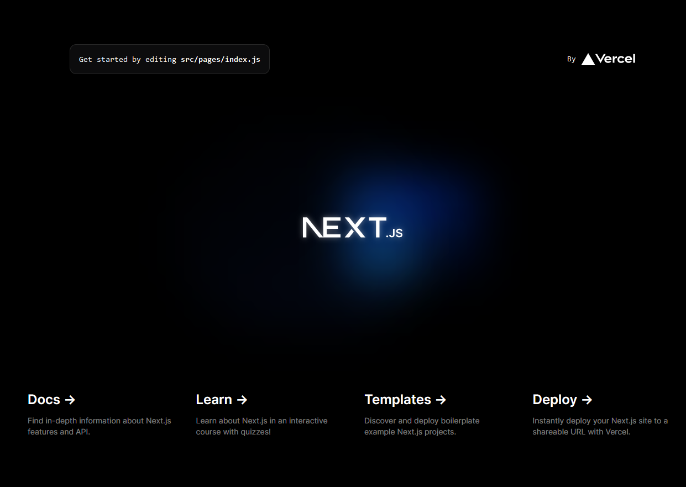
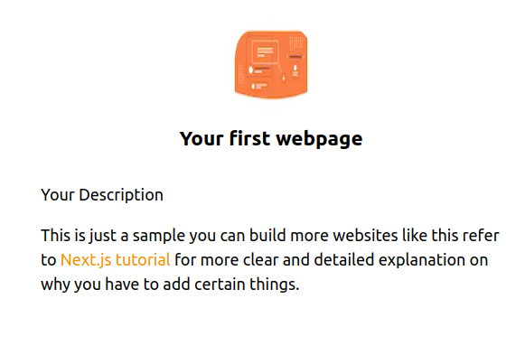

Next.js is a React framework are mainly used to create web applications and by framework I mean it takes care of the tooling and the configurations that are required for React. It uses Server-Side Rendering(SSR). *Okay now what is this SSR?* it does exactly what its name suggests "renders on the server" which means you are basically creating a HTML file with the all the website's content and then sending it to the user. SSR enables you to load pages faster even when you internet is slow, improves search engine optimization(SEO) and so on since we are not here to learn about server-side rendering. Now back to Next.js and why to use it.
________________

# Why Next.js?

Next.js is not the only framework that React has, one of their other popular framework is Gatsby. Now, comes the question of why you need to choose Next.js over the other frameworks. Though both Gatsby and Next.js are great on their on, for now lets just say that when I looked into both of them I found that Gatsby needs additional configurations that arent required in Next.js but incase you want to properly compare both of them I recommend [Next.js vs Gatsby](https://blog.logrocket.com/next-js-vs-gatsby-comparing-react-frameworks/) blog.
 
   * Has page-based routing system (for dynamic routes).
   * Optimized pre-fetching.
   * Client-side routing.
   * Pre-rendering and allows both static generation(SSG) and server-side rendering(SSR) for each page.

  # To create a website you need...

  * NodeJs installed on your local system

  To install Node.js you can follow instructions from [node.js installation](https://docs.npmjs.com/downloading-and-installing-node-js-and-npm)
  
  # Creating a webpage using Next.js

  Like any other framework Next.js also has its own command to setup a project. There are two ways in which you can do this.

  1. The first way is to open a terminal(command prompt) and type in the below line to start your project. This will ask you to for a project name.

   ```cmd
   yarn create next-app
   #or with npm:
   npx create-next-app@latest
  ```
 Once that is done you'll be able to access your project by running the commands below:

 ```cmd
 cd your-project-name
 yarn dev
 #or
 npm run dev
 ```
Now when you open the url http://localhost:3000 which will be visible on your terminal. Youl will be able to see a screen that might look something like this:



2. The second way is to manually create the project. Create a directory and then install the required dependencies using npm(Node Package Manager)

```cmd
mkdir your-project-name
#change directory to your project
cd your-project-name
```
Now add the package.json file in the root of your project directory 

```cmd
yarn init
#or
npm init
```
And finally to get started you'll need Next, React and react-dom npm packages. To install these use the below command:
```cmd
yarn add next react react-dom
#or
npm install next react react-dom
```
We'll be following 'process 1' for now. Let us create our first pafe now
### Creating your first page

To see changes in the 'localhost:3000' webpage. You need to make changes in index.js

Go to *[pages/index.js]* Remove the existing code in the index.js file and try adding the code below:

```js
import React from "react";

export default function FirstPage() {
  return (
      <div> Page 1 </div>
  );
}
```
If you want to create another page just add another page into the _pages_ folder. Ok, we have 2 pages but how do you connect and navigate between them? 
For this Nex.js has a special tag _Link_ tag. All you have to is 

```js
import Link from "next/link";
```
And then connect the two pages by adding the following code to <mark>pages/index.js</mark>

```js
import Link from "next/link";

export default function FirstPost() {
  return (
      <h1 className="title">
        Go to<Link href="/pages/newpage">another page</Link>
      </h1>
  );
}

```
But in this blog we are only concentrating on a single webpage. So let us add styles to our main page(index.js) for now.

### Adding styles to your pages

We already have styles folder with globals.css. We will also need CSS modules - which add CSS at the component-level locally by creating unique classNames automatically.

Create a _Layout component_ that can be used for all the pages:
* Create a _components_ folder and inside it create _layout.js_ and a CSS module called _layout.module.css_

In <mark>components/layout.module.css</mark> add the below code

```css
/* reference https://nextjs.org/learn/basics/assets-metadata-css/polishing-layout */

.container {
  max-width: 36rem;
  padding: 0 1rem;
  margin: 3rem auto 6rem;
}

.header {
  display: flex;
  flex-direction: column;
  align-items: center;
}

```
And in <mark>components/layout.js</mark> add the below code add:

```js
import styles from './layout.module.css';

export default function Layout({ children }) {
  return <div className={styles.container}>{children}</div>;
}
```

* CSS modules are useful for component-level styles but if we want to style every page we can do that by adding styles to _globals.css_

Add the code below to <mark>styles/globals.css</mark>

```css
/* reference https://nextjs.org/learn/basics/assets-metadata-css/polishing-layout */

html,
body {
  padding: 4;
  margin: 2;
  font-family: -apple-system, BlinkMacSystemFont, Segoe UI, Roboto, Oxygen, Ubuntu,
    Cantarell, Fira Sans, Droid Sans, Helvetica Neue, sans-serif;
  line-height: 1.6;
  font-size: 15px;
}

* {
  box-sizing: border-box;
}

a {
  color: #f39200;
  text-decoration: none;
}

a:hover {
  text-decoration: underline;
}

img {
  max-width: 100%;
  display: block;
}
```
To access the styling from globals.css you need to import them from <mark>pages/_app.js</mark> 

```js
import '../styles/global.css';

export default function App({ Component, pageProps }) {
  return <Component {...pageProps} />;
}
```
As we are on it already lets create one last styling files to styles text in our webpage

Create a CSS file called <mark>styles/utils.module.css</mark>

```css

/* reference https://nextjs.org/learn/basics/assets-metadata-css/polishing-layout */

.heading2XL {
    font-size: 2.5rem;
    line-height: 1.2;
    font-weight: 800;
    letter-spacing: -0.05rem;
    margin: 1rem 0;
  }
  
  .headingXl {
    font-size: 2rem;
    line-height: 1.3;
    font-weight: 800;
    letter-spacing: -0.05rem;
    margin: 1rem 0;
  }
  
  .headingLg {
    font-size: 1.5rem;
    line-height: 1.4;
    margin: 1rem 0;
  }
  
  .headingMd {
    font-size: 1.2rem;
    line-height: 1.5;
  }
  
  .borderCircle {
    border-radius: 9999px;
  }
  
  .colorInherit {
    color: inherit;
  }
  
  .padding1px {
    padding-top: 1px;
  }
  
  .list {
    list-style: none;
    padding: 0;
    margin: 0;
  }
  
  .listItem {
    margin: 0 0 1.25rem;
  }
  
  .lightText {
    color: #9812e6;
  }
```
Finally update <mark>components/layout.js</mark> and index.js
```js

import Head from "next/head";
import Image from "next/image";
import styles from "./layout.module.css";
import utilStyles from "../styles/utils.module.css";
import Link from "next/link";

const name = "Your first webpage";
export const pageTitle = "Next.js Sample Webpage";

export default function Layout({ children, page }) {
  return (
    <div className={styles.container}>
      <Head>
        <link rel="icon" href="/favicon.ico" />
        <meta name="description" content="building a webpage with next.js" />
      </Head>
      <header className={styles.header}>
        {page ? (
          <>
            <Image
              priority
              src="/images/website.jpg"
              className={utilStyles.borderCircle}
              height={160}
              width={160}
              alt=""
            />
            <h1 className={utilStyles.heading2Xl}>{name}</h1>
          </>
        ) : (
          <>
            <Link href="/">
              <Image
                priority
                src="/images/website.jpg"
                className={utilStyles.borderCircle}
                height={100}
                width={100}
                alt=""
              />
            </Link>
            <h2 className={utilStyles.headingLg}>
              <Link href="/" className={utilStyles.colorInherit}>
                {name}
              </Link>
            </h2>
          </>
        )}
      </header>
      <main>{children}</main>
    </div>
  );
}


```
In <mark>pages/index.js</mark>
```js
import Head from 'next/head';
import Layout, { siteTitle } from '../components/layout';
import utilStyles from '../styles/utils.module.css';

export default function Home() {
  return (
    <Layout home>
      <Head>
        <title>{siteTitle}</title>
      </Head>
      <section className={utilStyles.headingMd}>
        <p>Your Description</p>
        <p>
          This is just a sample you can build more websites like this refer to {' '}
          <a href="https://nextjs.org/learn"> 
          Next.js tutorial {''}
          </a>for more clear and detailed explanation on why you have to add certain things.
        </p>
      </section>
    </Layout>
  );
}
```
You should be able to see something like this at the end of it all:




# Conclusion
In this blog, we covered how to install Next.js, creating a webpage and also styling it. To get a detailed explanation on each topic you can look into [vercel's official blog](https://nextjs.org/learn/basics/create-nextjs-app) on Next.js. All I am trying to say is Next.js is a a great tool to create full-stack web applications and is easy to learn 😎, so what are you waiting for? 
