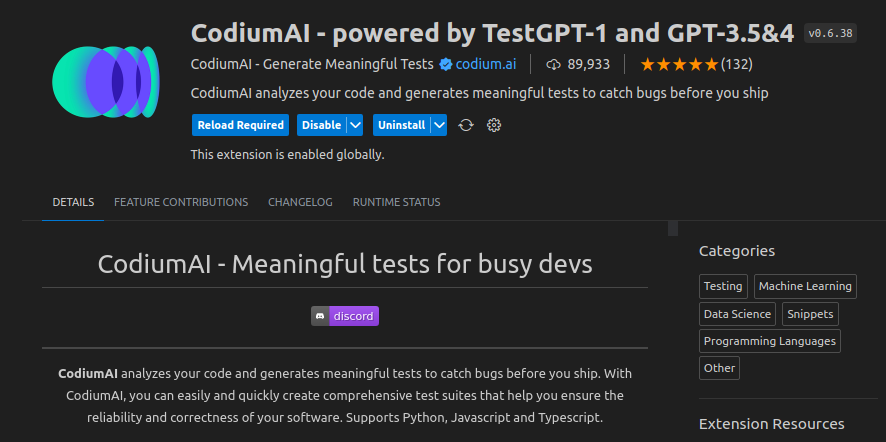
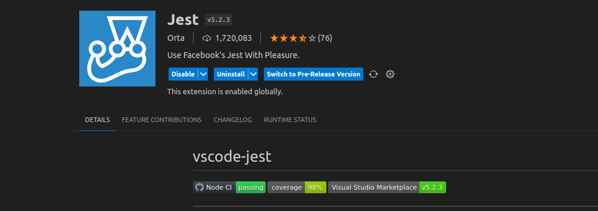
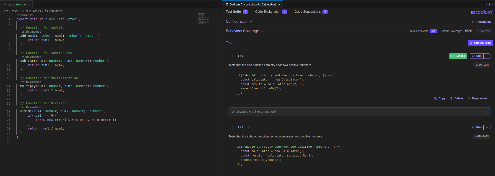

Unit Testing is mainly focused on testing every individual components called units. This allows us to ensure that all components code work as expected in all scenarios.

### What is a Unit Test case?
- Small, self-contained piece of code - to test a specific unit(component) for functionality.
- can be : Functions, Methods, Classes or even small components depending on the software.
Every unit test includes:
1. Providing conditions to test components.
2. Executing functionality of units.
3. Checking component behaviour against expected results.

### Why do we need unit testing?
Unit testing helps in many ways but mainly for:
- Early detection of isses
- Improving code quality
- Faster debugging
- Documentation
- Continuous integration
- Improving software design

### Codium AI - writing unit test cases with codium 
Codium AI is an IDE extension that interacts with the developers to generate meaningful tests and code explanations quickly. This will be useful to the developers to write test efficiently and quickly. CodiumAI analyzes your code, docstring, and comments, and then suggests tests as you code. Another thing about CodiumAI's test generation feature is that it helps you find edge cases and corner cases that can otherwise be missed by us. This ensures that the code is thoroughly tested and helps catc potential bugs before they become bigger issues.

#### Adding CodiumAI to your VScode 
In your VS code extensions marketplace, you should be able to see somethig like this:

**Step 1:** Install CodiumAI



**Step 2:** Install Jest



**Step 3:** Restart/ Reload VS code.

Lets take a sample code and see how this works. We'll be using typescript as the programming language, Jest as the testing framework and test cases in CodiumAI. 

`calculate.ts`

```ts 
export default class Calculator {
    
  // Addition Function
  add(num1: number, num2: number): number {
      return num1 + num2;
  }

  // Subtraction Function
  subtract(num1: number, num2: number): number {
      return num1 - num2;
  }

  // Multiplication Function
  multiply(num1: number, num2: number): number {
      return num1 * num2;
  }

  // Division Function
  divide(num1: number, num2: number): number {
      if(num2 === 0){
          throw new Error("Division by zero error");
      }
      return num1 / num2;
  }
}
```
Your `jest.config.js` will look something like this:

```js
module.exports = {
  transform: {
    '^.+\\.ts?$': 'ts-jest',
  },
  testEnvironment: 'node',
  testRegex: './src/.*\\.(test|spec)?\\.(ts|ts)$',
  moduleFileExtensions: ['ts', 'tsx', 'js', 'jsx', 'json', 'node'],
  roots: ['<rootDir>/src'],
};
```

Once we have everything - at the top of every function and method, CodiumAI adds "Test this function/method". When you click on `Test this` the test cases appear on the side. You can either run each test case or run all of them at once. 



If a test case fails - CodiumAI gives you an option to to `Analyze failure` so we can see what the issue is, right then and there. 

### Conclusion
You can also write unit test cases traditionally, by creating a test file - like for the above `calculator.js` code it'll be `calculator.spec.ts`. For more on this you can look at [Unit Test for beginners.](https://keencoder.dev/unit-testing-for-absolute-beginners)


