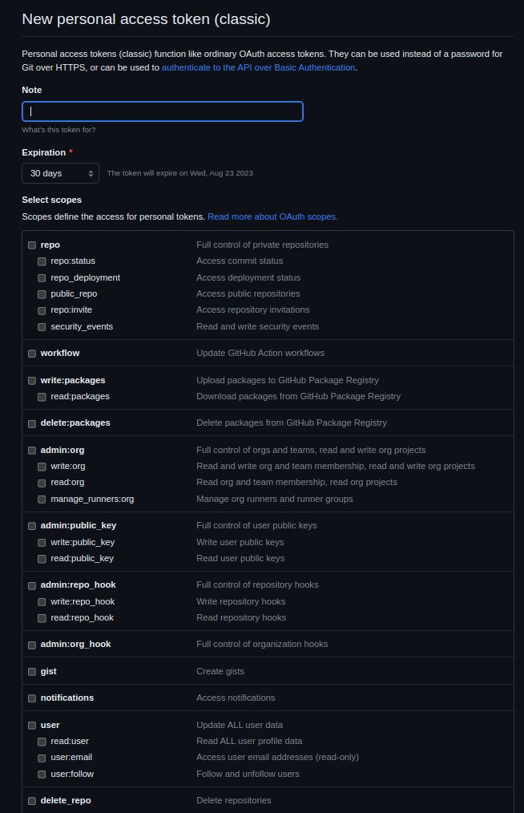

Package Registry Authentication is basically the process of verifying the users identity or any applications that are trying to access packages in the registry. `What are these package registries?` Package registries are centralized repositories - they store and distribute software packages, libraries and dependencies. If you want to add certain controls or security over who can perform what actions in the registry then authentication is the best way to do it. 

_________

## GitHub package registry authentication

For github's package registry authentication - Personal Access Tokens(PAT) can be used. In github PATs are mainly used to access its features and services. Usually PATs are alternatives to directly using passwords as they offer more control over what actions can be performed by the token holder.

## Why so we need GitHub PATs?

- **Access Control:** Ensures that only authorized users can access or use a specific package in the registry.
- **Rate Limiting:** Allows the registry to track usage and apply appropriate rate limits to each authentication user or application.
- **Enhanced Security:** PATs can be modified to specific permissions, limiting the actions that can be prformed using the token. This means that you will be able to generate tokens with all the necessary permissions which reduces the risk of unauthorized access.
- **Token Expiration:** Unlike passwords, you can set an expiration date for the access tokens - so even if a token gets compromised it'll only be valid for a limited period of time.
- **Revocation and Management:** If any time you wnt to revoke the access for a specific application or a service you can just delete the PAT associated to it without affecting your main GitHub account.
- **Fine-Grained Control:** GitHub also allows you to configure the scope of each PAT i.e you can create tokens with read-only access, write access or any other specific access.

## Adding GitHub Personal Access Token to VSCode

To authenticate yourself using Gitub PAT in VScode:

1. **Generate a Personal Access Token (PAT)**
- Login in to your GitHub account:
 >   *Go to Settings > Developer Settings(in the sidebar) > Personal access tokens*
- Click on "Generate a new token".
- Provide the token description and select the necessary scope/ permissions for the package registry access - read, write, delete packages or so on and click on generate token.

It may look something like this:



2. **Store the Personal Access Token**

Once your token is generated, make sure to copy it immediately, as you won't be able to see it again. Store it securely.

3. **Authenticate with the Package Manager** 

Depending on your programming language and the package manager, you need to configure it to use the generated PAT for authentication. So if you are using npm for JavaScript packages, you can set the token using:

```js
npm login --registry=https://npm.pkg.github.com --scope=@USERNAME
```
## How to installed a published package in code:
1. Create a `.npmrc` file inside the root directory of your repo.
2. Add your 

```js
registry= add link here
auth_token= (PAT created using the private github account)
```
3. Close and re-launch VSCode for the changes to take effect.

# Conclusion
In this blog, we looked at why we need Personal Access Tokens and how you can add them into your VSCode. If you would like to see an example for this on further steps to access a private repository you can look at [Install Intelops-UI package to your Code blog](https://capten.ai/learning-center/8-internal-guidelines/intelops-frontend/getting-started/installation/).

