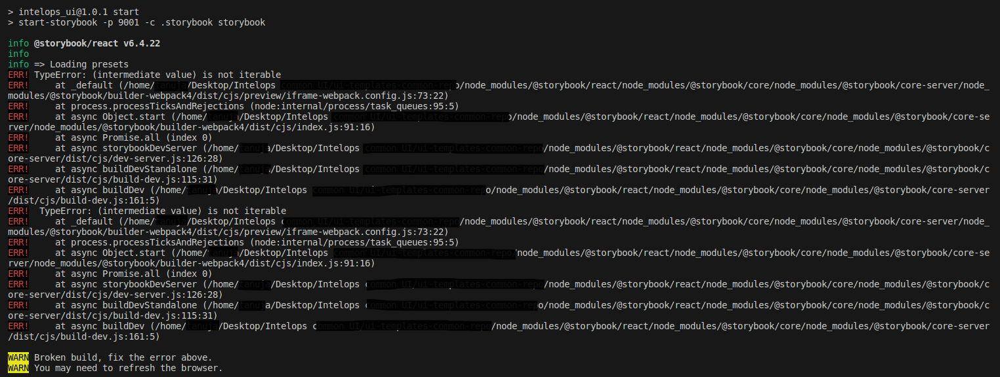
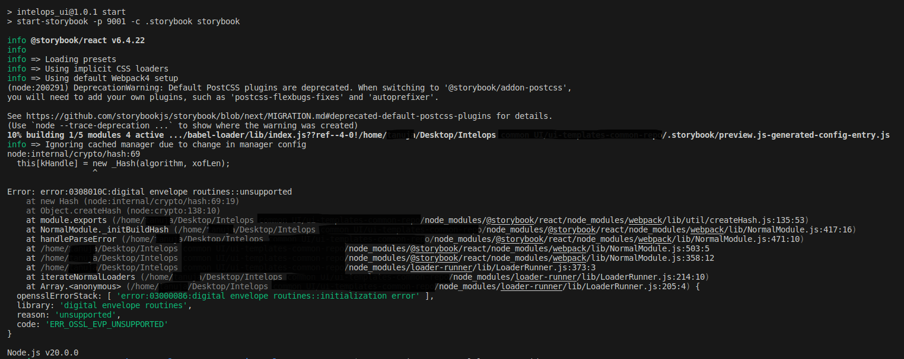
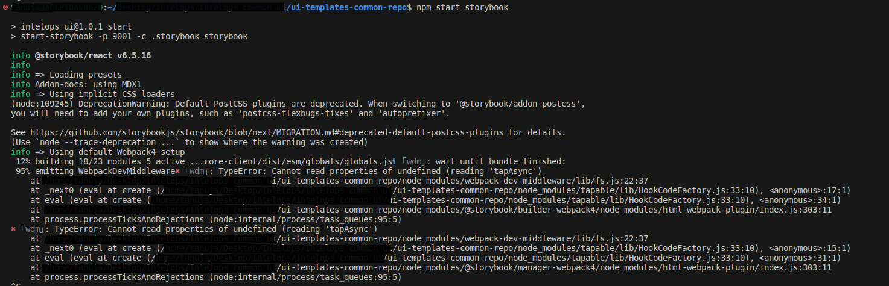

### Storybook.js
If you are looking at this Im guessing you already know what storybook is, but just to refresh everyone's memory : Storybook is an open-source development tool for building reusable UI components in isolation(away from the application or any framework). We can ot only develop but also test our components in isolation. Also allows better documentation and collaboration.

### Running Storybook.js
Once you have your application with atleast a few working components, you just have to install and run storybook. I thought I'll be able to test all my react components but had quite a few issues. I had to go through 8-9 stackoverflow and github pages to finally find one solution that actually worked for me so just wanted to state all of them in one place just in case someone else also faces the same issues.


```js 
npm start
//or 
npm run storybook
```

### Issues:
Okay, so you cloned a repo... will it start working as soon as you run? The answer is almost always NO. The first thing to check is for node modules (if you are using react frameworks). Don't have node_modules just install using:

**Issue 1: Missing node_modules**

```bash
npm install
```
Run storybook.

Now in an ideal case your application would work perfectly but in my case it did not: there were some errors from my `npm install`. So I tried **`npm install --force`**. I still had issues so I tried **`npm audit -fix --force`**. This lead to the application not recognizing storybook.js completely. The error looked something like this:

**Issue 2: Storybook command not found/ Node version conflict**
```bash
npm ERR! Failed at the redux-todomvc-example@0.0.0 storybook script 'start-storybook -p 9001'edux-todomvc-example@0.0.0 storybook /Users/Desktop/sample/storybooksample 
> start-storybook -p 9001 

sh: start-storybook: command not found 
```
This can happen if there is a "node version conflict", one of the obvious solutions was to downgrade my node version from v.20.x to v.16.x, but I did not want to do that - why? one there is a chance that this may crash your other projects that were built on new version and the other being why would you want to move backwards. 
So, I just tried uninstalling node modules and reinstalling them: 

```js
//uninstalling node_modules
rm -rf node_modules
//reinstalling 
npm install 
```
And thankfully it worked. If you don’t want to do this you can always move down node version, I personally don’t like doing that so I chose this method. 

Then we have yet another issue. 

**Issue 3: Storybook-addons error**

I tried running storybook again and yes, you guessed it a third error:




In this case removing `@storybook/addon-actions` from **addons** array should solve this error – you can just comment it out. 


This brings us to the last error that I got. 

**Issue 4: OpenSSL unsupported**

It looked something like this:



If you carefully look at the end of the error you can see **ERR_OSSL_EVP_UNSUPPORTED**

Now  this happens because up until Node v17.x OpenSSL v2 was used. OpenSSL is used by NodeJS for hash functionality code. Version 3 of OpenSSL disables MD4 which is why node.js is broken in the latest node versions.  
That being said there are multiple ways to solve this issue : 

- One way is to try and update your start script in package.json to use 

```bash
react-scripts --openssl-legacy-provider start 
```
- If that doesn’t work try: 

```js
//In linux
export NODE_OPTIONS=--openssl-legacy-provider
//In windows - just replace the export with “set” 
set NODE_OPTIONS=--openssl-legacy-provider
```
If you are lucky this might be the end of the issues, but then I wasn't so a new issue popped up - now I had a conflict with the webpack versions. And the error looked something like this:


Check your `package.json` file you probably must be using the latest version of webpack and a older version of storybook, if that is the case - then all you have to do is upgrade your storybook version.

```js
npx storybook upgrade
```
Finally now if you try to do npm start storybook or npm run storybook - you will be able to see storybook up and running.
 
### Conclusion
I tried to cover all the issue that I faced, and since you reached till here, I am guessing that your issues also got solved, hopefully. That being said storybook.js is a great way to test your components so don't let the errors stop you from using it. 
