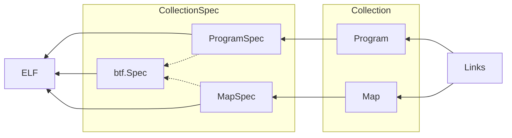

Cilium is an open-source project that provides a networking and security solution for containerized applications that leverages eBPF technology. The __Cilium eBPF library__ provides a Go interface to the eBPF subsystem, making it easier to write eBPF programs in Go.

The Cilium eBPF library is a Go library that provides abstractions over eBPF programs and maps, as well as helpers for loading and attaching eBPF programs to various hooks in the Linux kernel.

[Refer Cilium ebpf repository](https://github.com/cilium/ebpf)

[Refer ebpf Official Documentation ](https://pkg.go.dev/github.com/cilium/ebpf)

### Architecture of library



[Refer for architecture](https://github.com/cilium/ebpf/blob/master/ARCHITECTURE.md)

## Cilium ebpf project structure 

```
$tree xdp
xdp
|----bpf_bpfeb.go
|----bpf_bpfeb.o
|----bpf_bpfel.go
|----bpf_bpfel.o
|----main.go
|____xdp.c    

0 directories,6 files
```

The ebpf program's source code file,__xdp.c__ in the diagram, is compiled using __bpf2go__, a code generation tool provided by cilium/ebpf. 
bpf2go uses the clang compiler to generate two ebpf bytecode files: "bpf_bpfeb.o" for big-endian and "bpf_bpfel.o" for little-endian systems. Additionally, bpf2go generates "bpf_bpfeb.go" or "bpf_bpfel.go" files based on the corresponding bytecode file. 
These go source files contain the ebpf program's bytecode as binary data.

The "main.go" file is responsible for the user state of the ebpf program. Compiling "main.go" with either "bpf_bpfeb.go" or "bpf_bpfel.go" creates the final ebpf program.

[Read more about bpf2go](https://github.com/cilium/ebpf/tree/master/cmd/bpf2go)


These files are part of the Cilium eBPF library and are used to compile, load and execute eBPF programs within the Cilium datapath.The two binary formats (bpfeb and bpfel) are used to represent eBPF bytecode in different endianness, depending on the target architecture.

1. `bpf_bpfeb.go` and `bpf_bpfeb.o` are related to the big-endian eBPF (bpfeb) binary format. `bpf_bpfeb.go` is the Go language binding for the bpfeb binary format, while `bpf_bpfeb.o` is the actual binary file that contains the compiled eBPF bytecode in the bpfeb format.

2. `bpf_bpfel.go` and `bpf_bpfel.o` are related to the little-endian eBPF (bpfel) binary format. `bpf_bpfel.go` is the Go language binding for the bpfel binary format, while `bpf_bpfel.o` is the actual binary file that contains the compiled eBPF bytecode in the bpfel format.


## Headers

These are the headers provided by Cilium ebpf library.

1.  `bpf_helpers.h`: Defines helper functions provided by the kernel to eBPF programs, such as map lookup and modification, packet I/O operations, and synchronization primitives.
2.  `bpf_endian.h`: Provides conversion functions for different endianness of the data, as the eBPF program runs on a different endianness than the user space program.
3. `bpf_core_read.h`: Provides functions for reading kernel data structures in eBPF programs, such as the sk_buff structure.
4. `bpf_core_write.h`: Provides functions for writing to kernel data structures in eBPF programs, such as setting the return value of a system call.
5. `bpf_debug.h`: Defines debugging helpers for eBPF programs, such as printing data and map contents.
6. `bpf_net_helpers.h`: Provides helper functions for network-related tasks, such as TCP connection tracking and DNS lookup.
7. `bpf_time_helpers.h`: Provides helper functions for timestamp and time conversion.

These headers are included in the Cilium eBPF library and can be used in eBPF C programs to interact with the kernel and perform various tasks.