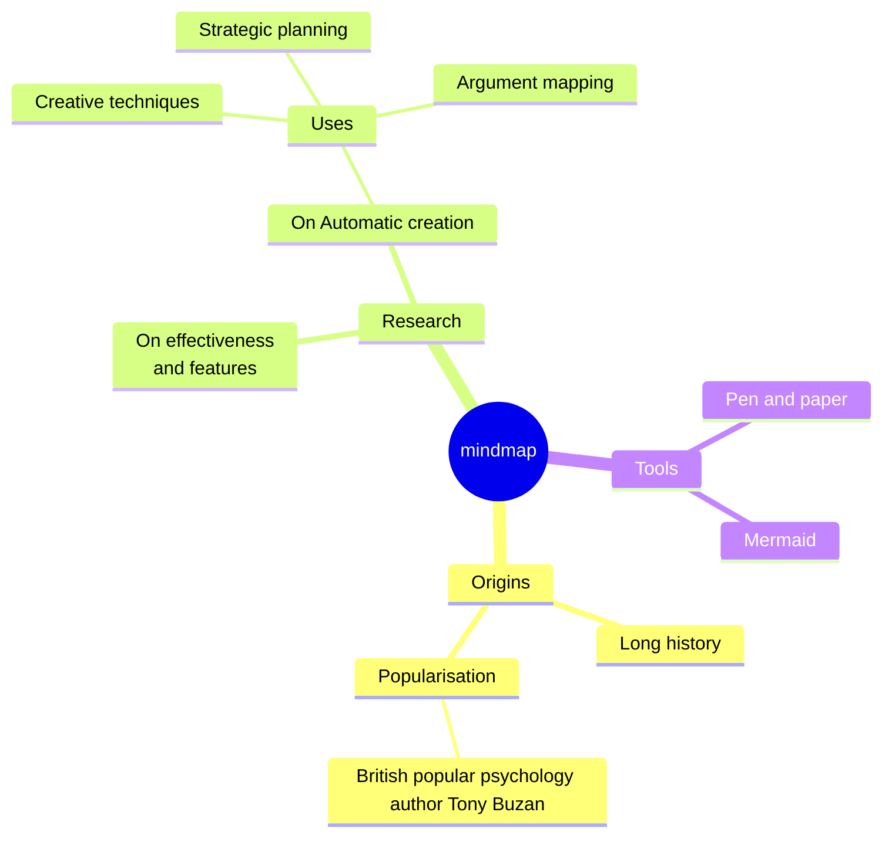

This is the start of dummy description text. You can change it whenever you want. It is used to test the responsiveness of the site. It is not used in the actual site. This is the start of dummy description text. You can change it whenever you want. It is used to test the responsiveness of the site. It is not used in the actual site. 

This is the start of dummy description text. You can change it whenever you want. It is used to test the responsiveness of the site. It is not used in the actual site. This is the start of dummy description text. You can change it whenever you want. It is used to test the responsiveness of the site. It is not used in the actual site. 